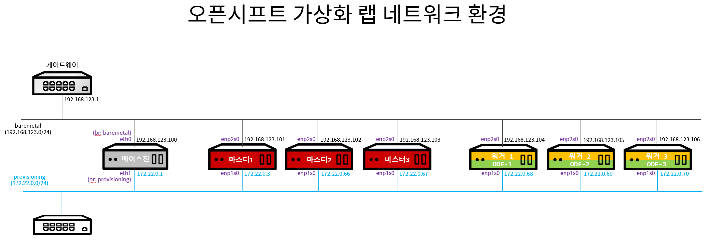
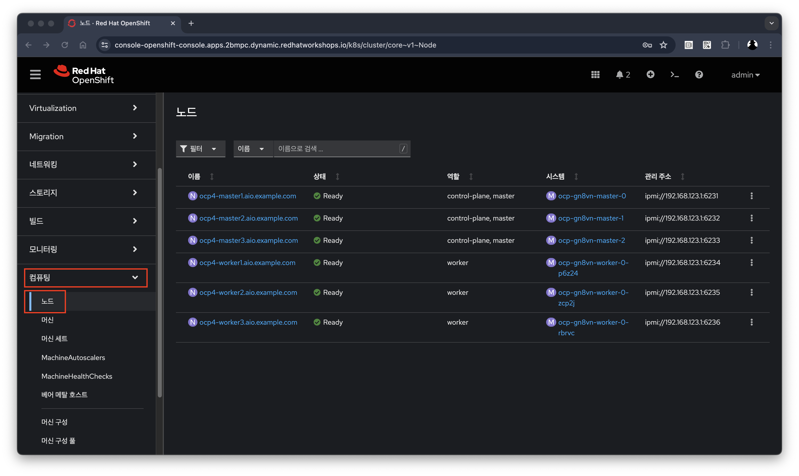
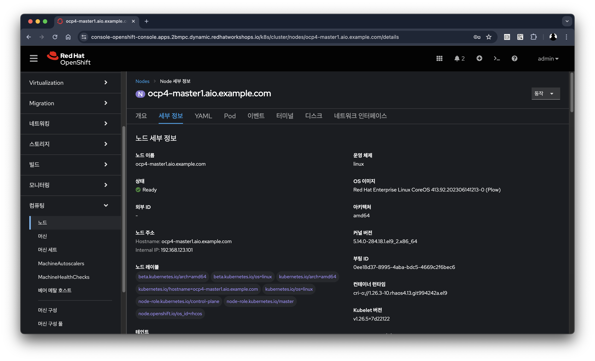
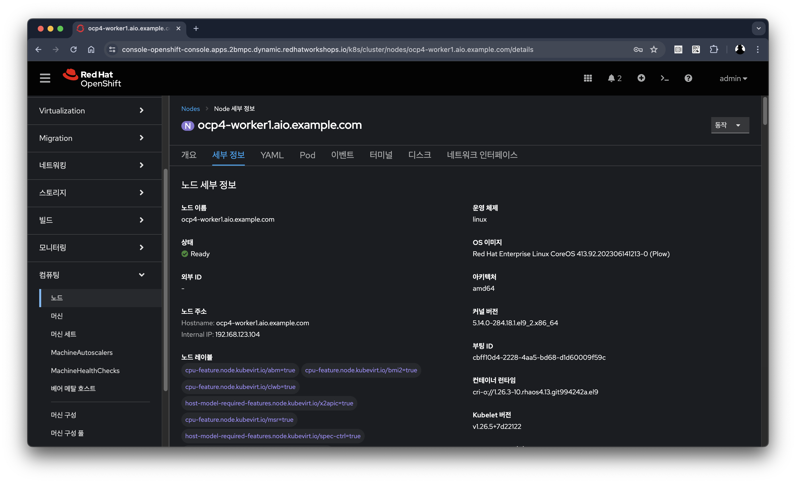
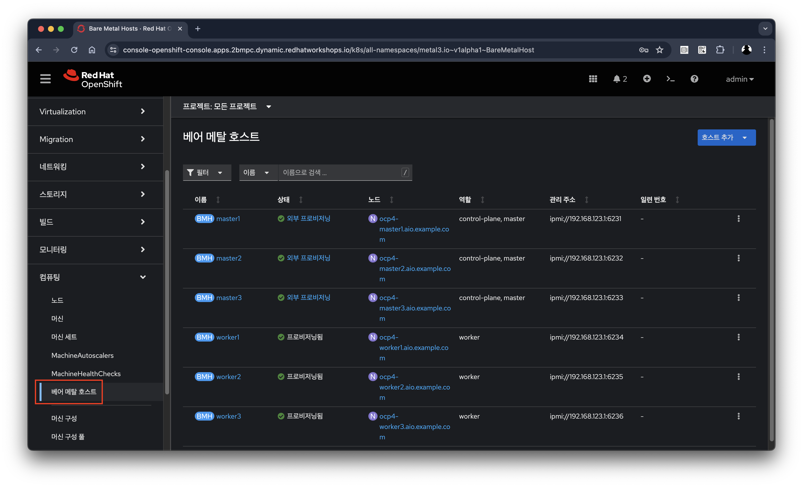
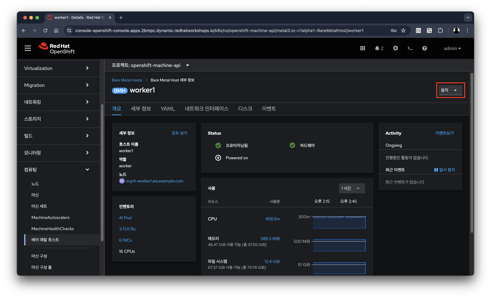

# 랩 환경

목차
1. [소개](./lab_review.md#1-소개)<br>
   1.1 [지원되는 플랫폼](./lab_review.md#11-지원되는-플랫폼)<br>
   1.2 [오픈시프트 가상화 요구 사항](./lab_review.md#12-오픈시프트-가상화-요구-사항)<br>
2. [레드햇 오픈시프트 클러스터](./lab_review.md#2-레드햇-오픈시프트-클러스터)<br>
   2.1 [노드와 머신](./lab_review.md#21-노드와-머신)<br>
   2.2 [베어메탈 호스트](./lab_review.md#22-베어메탈-호스트)<br>
3. [요약](./lab_review.md#3-요약)
<br>
<br>

## 1. 소개

이 실습에서는 이 워크샵 중에 사용된 환경을 검토합니다.
<br>

**목표**
* 레드햇 오픈시프트 클러스터의 노드와 머신을 살펴보세요.

이 섹션에서는 제공된 레드햇 오픈시프트 환경을 살펴보겠습니다. 이 환경은 Equinix 클라우드의 베어메탈 호스트에서 실행됩니다. 이 클러스터의 노드가 구성되는 방식과 노드의 하드웨어 기능을 이해하게 됩니다.
<br>

### 1.1 지원되는 플랫폼

* 현재 오픈시프트 가상화는, 온프레미스 또는 이와 유사한 위치에서, 자체 관리형 베어메탈 서버를 통해 완벽하게 지원됩니다. 오늘 실습 환경에서 사용하고 있는 장비는 Equinix에 배포된 오픈시프트 클러스터입니다.
* Amazon Web Services(AWS) 베어메탈 인스턴스는 Technical Preview입니다. 자세한 내용은 [AWS 베어메탈 노드에 오픈시프트 가상화 배포](https://access.redhat.com/articles/6409731)를 참조하세요.
* IBM 클라우드 베어메탈 서버는 Technocal Preview입니다. 자세한 내용은 [IBM 클라우드 베어메탈 노드에 오픈시프트 가상화 배포](https://access.redhat.com/articles/6738731)를 참조하세요.
<br>

> [!NOTE]
> AWS 베어메탈 인스턴스 또는 IBM 클라우드 베어메탈 서버에 오픈시프트 가상화를 설치하는 것은 Technical Preview 기능입니다. Technical Preview 기능은 레드햇 프로덕션 서비스 수준 계약(SLA)에서 지원되지 않으며 기능적으로 완전하지 않을 수도 있습니다. 레드햇은 이를 프로덕션 환경에서 사용하는 것을 권장하지 않습니다. 이러한 기능은 향후 제품 기능에 대한 조기 액세스를 제공하므로 고객은 개발 프로세스 중에 기능을 테스트하고 피드백을 제공할 수 있습니다.
<br>

### 1.2 오픈시프트 가상화 요구 사항

오픈시프트 가상화 기능을 설치하기 전에 레드햇 오픈시프트 클러스터가 다음 요구 사항을 충족하는지 확인하십시오.

* CPU 요구 사항
  + Red Hat Enterprise Linux(RHEL) 8 이상에서 지원됨
  + Intel 64 또는 AMD64 CPU 확장 지원
  + Intel VT 또는 AMD-V 하드웨어 가상화 확장이 활성화됨
  + NX(실행 없음) 플래그가 활성화
* 저장 요구사항
  + 오픈시프트에서 지원됨
  + CSI 제공자를 적극 권장
  + 실시간 마이그레이션에는 ReadWriteMany(RWX) PVC가 필요
  + CSI 클론 또는 스냅샷을 통해 가속화된 볼륨 생성을 지원하는 CSI 프로비저너를 사용하면 템플릿에서 가상머신을 훨씬 빠르게 생성 가능
  + CSI 프로비저너를 사용할 수 없는 경우 오픈시프트 가상화는 호스트 복사본을 사용하도록 대체
* 오픈시프트 클러스터 노드 요구 사항
  + 작업자 노드에 설치된 RHCOS(Red Hat Enterprise Linux CoreOS)
  + 가상 머신 워크로드를 호스팅하기에 충분한 CPU, 메모리 및 네트워크 용량

오픈시프트 가상화의 하드웨어에 대한 특정 요구 사항 및 지침에 대한 [문서](https://docs.openshift.com/container-platform/4.15/virt/install/preparing-cluster-for-virt.html)를 검토하세요.
<br>

> [!NOTE]
> 클러스터가 서로 다른 CPU를 갖춘 워커 노드를 사용하는 경우 Intel과 AMD는 CPU마다 성능이 다르기 때문에 라이브 마이그레이션 실패가 발생할 수 있습니다.
<br>
<br>

## 2. 레드햇 오픈시프트 클러스터

오픈시프트 클러스터가 배포되어 있는 구성도는 다음과 같습니다.

</img> <br>

* 베이스천 노드 * 1*ea*
* 마스터 노드 * 3*ea*
* 워커 노드 * 3*ea*
<br>

IPI(Installer Provisioned Infrastructure) 방법을 사용하여 배포할 때 오픈시프트는 컨트롤러 용 하드웨어를 관리하기 위해 [Metal3](https://metal3.io/)를 사용합니다. 이로 인해 하드웨어는 클러스터에서 세 가지 다른 방식으로 표시됩니다.
|$\color{lime}{\texttt{이름}}$|$\color{lime}{\texttt{설명}}$|
|:---:|:---|
|[`Node`](https://docs.openshift.com/container-platform/4.15/nodes/index.html)|<ul><li>쿠버네티스 스케줄러에서 확인하고 사용</li><li>클러스터에서 사용 가능한 리소스를 나타내는 개체</li></ul>|
|[`Machine`](https://docs.openshift.com/container-platform/4.15/machine_management/index.html)|<ul><li>인프라 제공자가 관리하는 개체</li><li>실습에서 오픈시프트 가상화를 사용할 때, Metal3 오퍼레이터에 의해 추상화되는 물리적 서버</li><li>MachineSet 패러다임을 통해 세트로 그룹화되고 관리</li>|
|`BareMetalHost`|<ul><li>물리적 서버 관리와 가장 낮은 수준의 직접적인 상호 작용하는 개체</li></ul>|
<br>

### 2.1 노드와 머신

레드햇 오픈시프트와의 거의 모든 상호 작용은 오픈시프트 콘솔에서 수행될 수 있습니다. 콘솔은 관리자와 사용자 모두가 안내 방식으로 플랫폼을 사용할 수 있도록 하는 모든 기능을 갖춘 웹 애플리케이션입니다. 시스템을 쉽게 관리할 수 있도록 대부분의 작업에 마법사가 제공됩니다.

1. 오픈시트프 콘솔 URL로 이동하여 사용자 admin과 비밀번호 %openshift_password%로 로그인합니다.

   ```
   https://console-openshift-console.apps.${GUID}.dynamic.redhatworkshops.io/
   ```
<br>

2. 탐색 메뉴에서 **컴퓨팅** → **노드**를 선택합니다.
   </img> <br> 
   오픈시프트 4 클러스터에는 3개의 컨트롤-플레인 노드와 3개의 워커 노드가 있습니다. 또한 베어메탈 노드를 관리하기 위해 IPMI(Intelligent Platform Management Interface)를 사용합니다.

   노드는 오픈시프트 클러스터의 가상 또는 베어메탈 머신입니다. 워커 노드는 가상머신 및 기타 워크로드를 호스팅합니다. 컨트롤-플레인 노드는 오픈시프트 클러스터를 제어하고 관리하는 데 필요한 서비스를 실행합니다.
<br>

3. 노드에 대한 리소스 정보를 얻으려면 워커 노드 중 하나를 클릭하세요.
   </img> <br> 
   **개요** 탭에는 CPU, 메모리 등 리소스 활용도에 대한 유용한 정보가 표시됩니다. 또한 이 노드 내부에서 실행 중인 모든 애플리케이션(**Pod**)도 표시됩니다.

> [!NOTE]
> 오픈시프트 가상화는 하나 이상의 물리적 노드가 필요하며 "중첩" 및 에뮬레이션은 지원되지 않습니다. 그러나 클러스터의 다른 노드인 컨트롤-플레인 및 인프라 노드는 가상머신으로 구성할 수 있습니다.
<br>

4. 운영체제에 대한 자세한 정보를 얻으려면 **세부 정보** 탭으로 이동하십시오.
   </img> <br>
<br>

### 2.2 베어메탈 호스트

BMC(Baseboard Management Console)를 사용하면 레드햇 오픈시프트 콘솔을 사용하여 노드를 관리할 수 있습니다.

1. **컴퓨팅** → **베어 메탈 호스트**를 선택합니다.
   </img> <br>
   설치 중에 **컨트롤-플레인** 노드가 프로비저닝되고(따라서 상태가 외부 프로비저닝됨) 컨트롤-플레인이 준비되면 **워커** 노드가 프로비저닝되고(프로비저닝됨 상태) 클러스터에 조인됩니다. 이 실습에는 포함되지 않지만 호스트 추가 버튼을 사용하여 새 호스트를 추가하여 클러스터를 확장할 수 있습니다.
<br>

2. 물리적(베어메탈) 노드에 대한 정보를 얻으려면 워커 노드 중 하나를 클릭하십시오.
   </img> <br>
   표시된 정보는 하드웨어 및 베어메탈 노드의 물리적 상태와 관련된 정보를 제공한다는 점을 제외하면 노드 정보와 유사합니다. **동작** 드롭다운 메뉴를 사용하면 `BMC`를 사용하여 시스템을 다시 시작하거나 중지하는 등 베어메탈 호스트의 측면을 관리할 수 있습니다.
<br>

3. *네트워크 인터페이스* 및 *디스크*를 포함하여 호스트에 대한 자세한 내용을 보려면 다른 탭을 탐색하십시오. 또한 **동작** 메뉴의 `프로비저닝이 해제`를 선택하면 호스트가 클러스터에서 제거되고 RHCOS가 제거되며 시스템이 구성 준비가 된 것으로 표시됩니다.
<br>
<br>

## 3. 요약

랩을 통해 레드햇 오픈시프트 클러스터와 이 환경을 구성하는 하드웨어에 대해 확인 하였습니다.
<br>
<br>

------
[차례](../README.md) &nbsp;&nbsp;&nbsp;&nbsp; [<< 오픈시프트 가상화 소개 <<](./openshift_virt_overview.md) &nbsp;&nbsp;&nbsp;&nbsp; [>> 오픈시프트 가상화 기본 >>](./openshift_virt_basic.md)