# 네트워크 관리

목차
1. [네트워크 관리 소개](./network_management.md#1-네트워크-관리-소개)<br>
2. [Network Attachment Definition 생성](./network_management.md#2-network-attachment-definition-생성)<br>
3. [외부 네트워크 가상머신 연결](./network_management.md#3-외부-네트워크-가상머신-연결)<br>
4. [요약](./network_management.md#4-요약)
<br>
<br>

## 1. 네트워크 관리 소개

기본적으로 모든 가상머신은 오픈시프트 SDN(소프트웨어 정의 네트워크)에 연결되어 있어 다른 가상머신 및 오픈시프트 기본 애플리케이션을 포함하여 오픈시프트 클러스터의 다른 워크로드에서 액세스할 수 있습니다.

* SDN은 클러스터에 가상머신 또는 Pod로 배포되는지 여부에 관계없이 제어된 방식으로 애플리케이션을 추상화, 연결 및 노출하기 위한 추가 기능을 제공합니다. 해당 기능에는 오픈시프트의 `서비스` 및 `경로`가 포함됩니다.
* 오픈시프트의 네트워크 정책 엔진을 사용하면 가상머신 사용자 또는 관리자가 개별 가상머신 또는 전체 프로젝트/네임스페이스 간의 네트워크 트래픽을 허용하거나 거부하는 규칙을 생성할 수 있습니다.

그러나 필요한 경우 가상머신은 VLAN과 같은 하나 이상의 외부 네트워크에 직접 연결할 수도 있습니다. 이는 SDN에 추가되는 기능입니다. 즉, 예를 들어 관리자는 외부 IP 주소에서 가상머신에 연결할 수 있지만 애플리케이션은 SDN을 통해 오픈시프트 가상화에서 호스팅하는 다른 가상머신과 통신합니다.

높은 수준에서는 모드 4(LACP) 본드 생성 및 맨 위에 리눅스 브리지 생성과 같은 호스트 네트워킹을 구성하여 이를 수행합니다. 이 워크숍 세그먼트에서는 가상머신이 해당 브리지에 연결되어 외부 네트워크에 직접 연결할 수 있도록 하는 **Network Attachment Definitions**을 생성하는 프로세스의 다음 단계를 안내합니다.

> [!NOTE]
> 오픈시프트 환경은 가상머신이 연결할 각 컴퓨팅 노드에 리눅스 브리지로 이미 구성되어 있으므로 외부 네트워크 리소스와 쉽게 연결할 수 있습니다.

<br>

**목표**
* Network Attachment Definitions 만들기
* 가상머신을 외부 네트워크에 연결
<br>
<br>

## 2. Network Attachment Definition 생성

가상머신에서 리눅스 브리지를 사용하려면 **Network Attachment Definition**를 생성해야 합니다. 이는 오픈시프트에 네트워크에 대해 알려주고 가상머신이 네트워크에 연결할 수 있도록 허용합니다. Network Attachment Definition은 `default` 프로젝트에서 생성되지 않는 한 생성된 프로젝트/네임스페이스에만 적용됩니다. 이를 통해 관리자는 자신의 가상머신들을 관리할 수 있는 액세스 권한이 있는 사용자가 사용할 수 있는 네트워크와 사용할 수 없는 네트워크를 제어할 수 있습니다. Network Attachment Definition이 생성되면 가상머신에서 네트워크 어댑터를 구성할 때 사용할 수 있습니다.

> [!NOTE]
> 시간적 제약으로 인해 이 실습에서는 호스트 네트워크가 이미 구성되어 있습니다. 구성을 보고 관리하는 방법과 함께 호스트 네트워킹에 대해 자세히 알아보려면 [여기](https://docs.openshift.com/container-platform/4.13/networking/k8s_nmstate/k8s-nmstate-observing-node-network-state.html)에 있는 NMState 설명서를 사용하세요.

<br>

1. **네트워킹** → **NetworkAttachmentDefinitions**로 이동하고 **Create network attachment definition**을 클릭 합니다.

   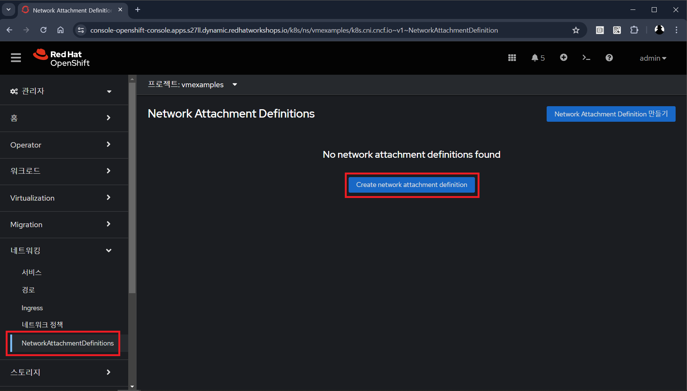</img> <br> 

> [!IMPORTANT]
> 프로젝트 `vmexamples`를 선택합니다.
<br>

2. 다음과 같이 `vmexamples` 프로젝트에 대한 양식을 작성한 후 **만들기**를 클릭합니다.

   * **이름**: `flatnetwork`
   * **Network Type**: `CNV Linux Bridge`
   * **Bridge Name**: `br-flat`

   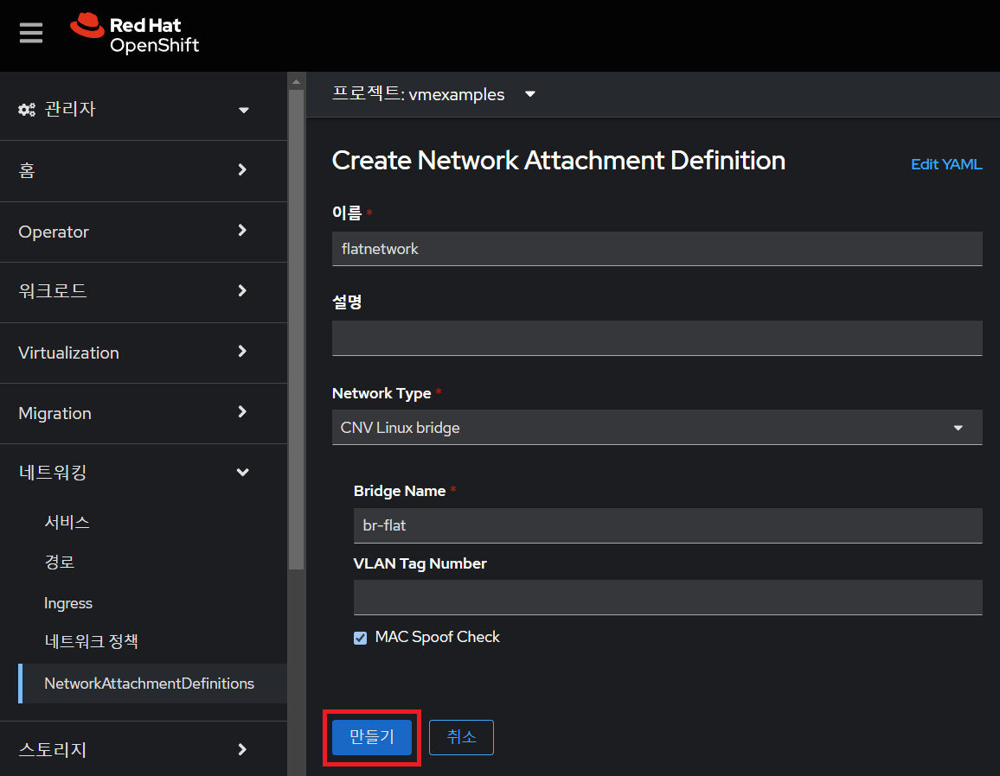</img> <br> 

   호스트의 단일 리눅스 브리지에는 다양한 VLAN이 있을 수 있습니다. 이 시나리오에서는 별도의 호스트 인터페이스와 브리지가 아닌 각 항목에 대한 Network Attachment Definition만 생성하면 됩니다.
   
> [!NOTE]
> 위 양식에는 VLAN 태그를 할당해야 하는 네트워크에 연결할 때 사용되는 `VLAN Tag Number`에 대한 입력이 있습니다. 이 실습에서는 태그가 지정되지 않은 네트워크를 사용하므로 여기에는 VLAN 번호가 필요하지 않습니다.
<br>

3. *Network Attachment Definition*의 세부사항을 조사하십시오. `vmexamples` 프로젝트에서 생성되었기 때문에 다른 프로젝트에서는 사용할 수 없습니다.

   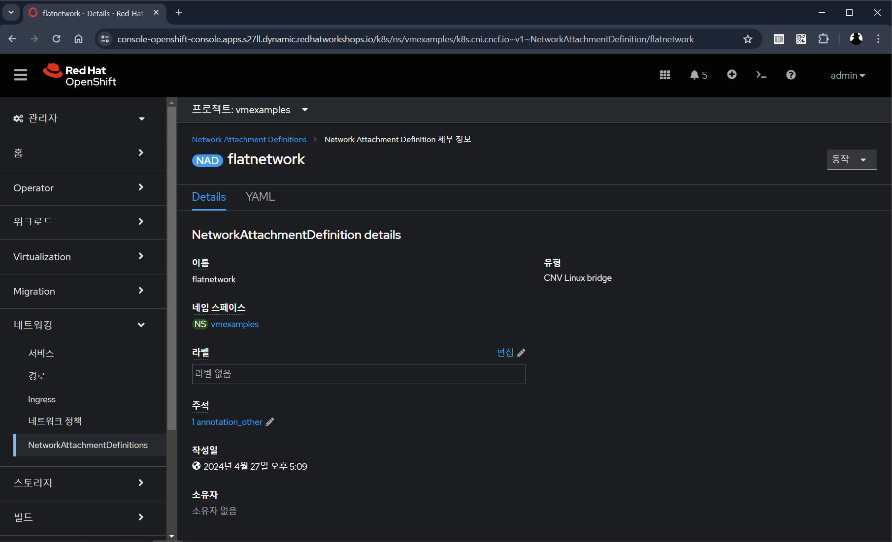</img> <br>
<br>
<br>

## 3. 외부 네트워크 가상머신 연결

1. **Virtualization** → **VirtualMachines**으로 이동하여 `fedora02` 가상머신을 선택합니다. **Configuration** 탭을 클릭한 다음 **Network Interfaces** 하위 탭을 클릭합니다.

   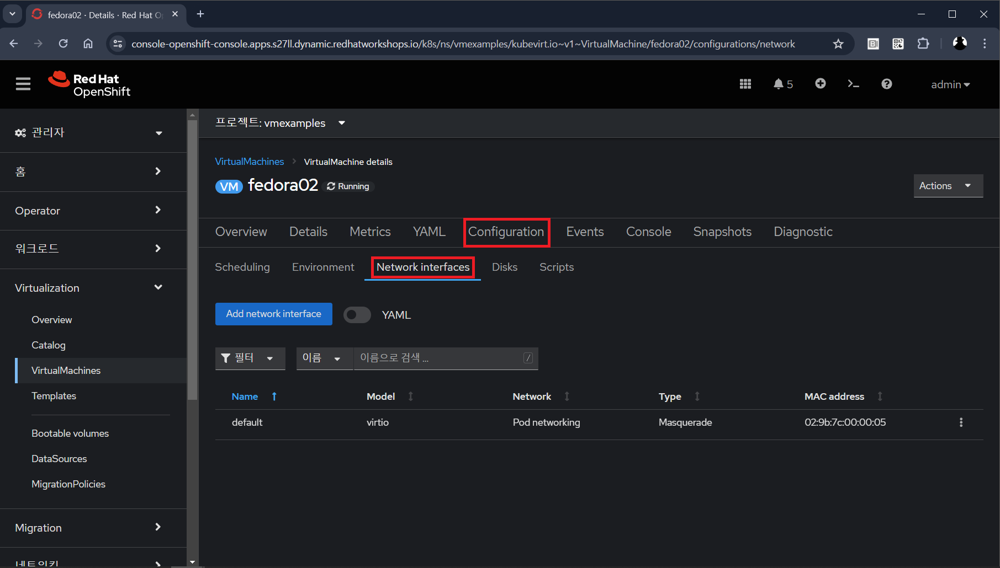</img> <br>
<br>

2. **Add network interface**를 클릭하고 표시된 대로 양식을 작성한 다음 **Save**를 클릭합니다.

   이는 외부 네트워크에 연결되는 브리지이기 때문에 네트워크를 사용하는 가상머신에 대한 masquerade(NAT)와 같은 액세스를 활성화하기 위해 오픈시프트 기능이나 성능에 의존할 필요가 없습니다. 결과적으로 여기서 **Type**은 `Bridge`여야 합니다.

   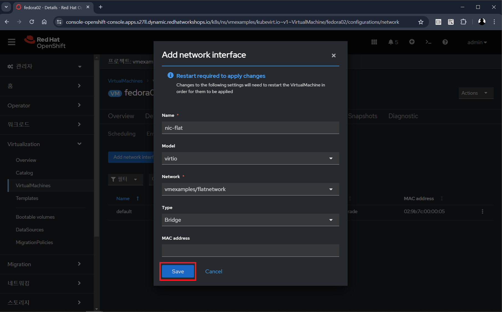</img> <br>
<br>

3. **Actions** 메뉴의 *Restart*를 클릭하여 가상머신을 다시 시작합니다. 

   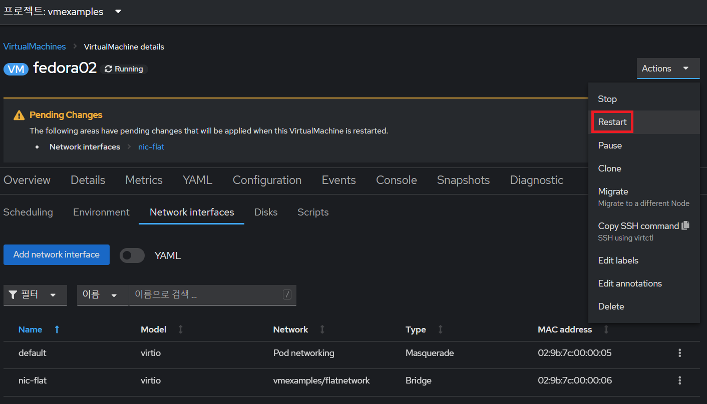</img> <br>
<br>


4. 재부팅 후 **Console** 탭으로 이동합니다.

   `eth1` 인터페이스는 플랫 네트워크(`192.168.3.x/24`)에서 IP 주소를 얻습니다. 해당 네트워크에는 IP를 제공하는 DHCP 서버가 있습니다.

   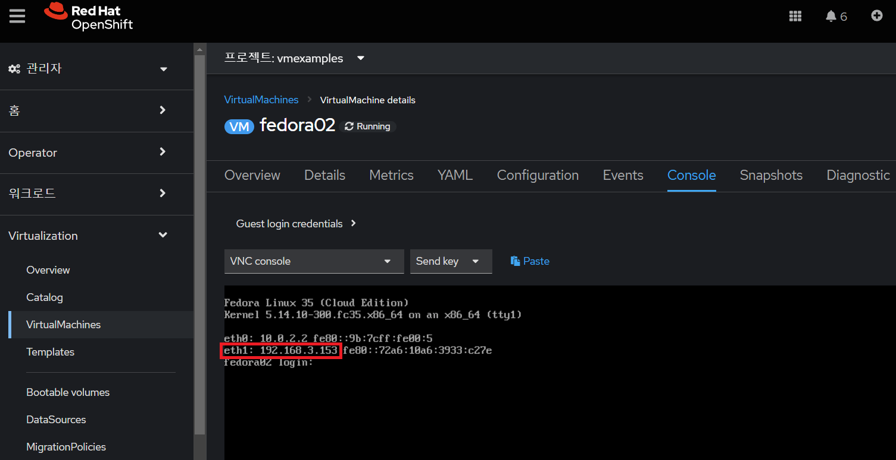</img> <br>
<br>

5. (선택 사항) 배스천 호스트를 사용하여 가상머신의 외부 연결을 확인합니다. 이 워크숍 시작 시 공유된 실습 환경 자료에 제공된 대로 SSH를 통해 호스트에 연결합니다.
   1. 오른쪽 상단 아이콘을 눌러 터미널을 엽니다.

      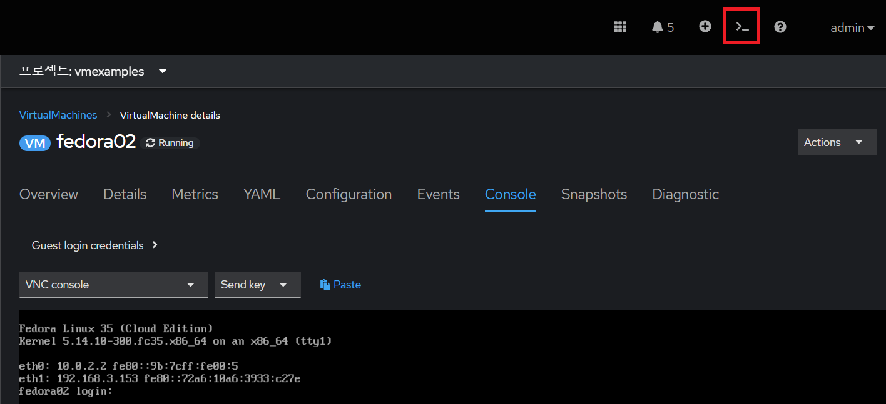</img> <br>

   2. 화면 하단에 콘솔이 나타납니다.
      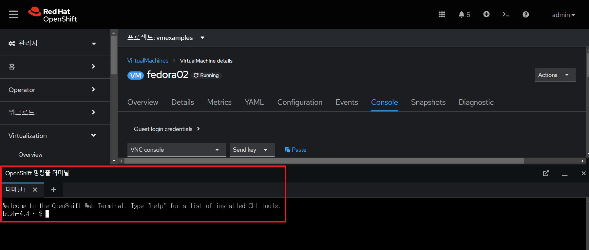</img> <br>

> [!NOTE]
> 처음 시도하는 경우에 가상머신 터미널 초기화를 위해 **시작**을 누릅니다.<br>
> <br>
> 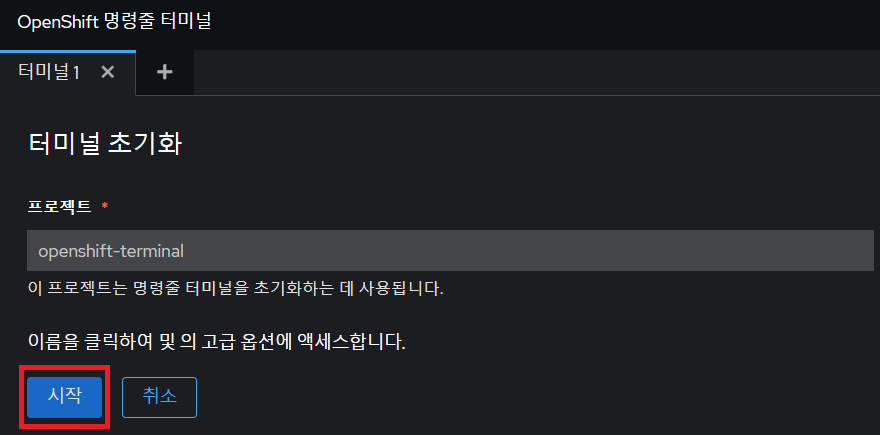</img> <br>

   3. IP를 교체하려면 다음 명령을 입력하십시오.
      
      ```bash
      bash-4.4 ~ $ curl 192.168.3.153:22
      ```

      실행 결과
      ```bash
      SSH-2.0-OpenSSH_8.7
      ```
      
      실행 결과는 다음과 같습니다.
      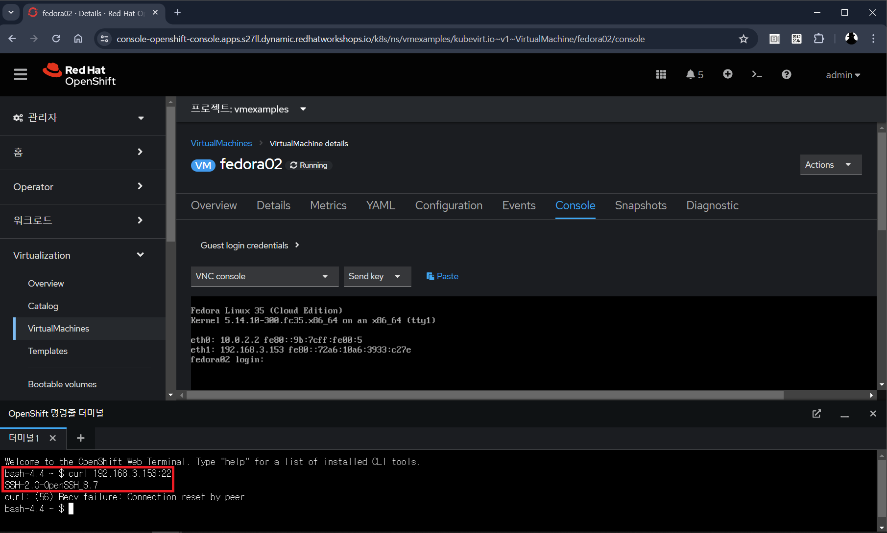</img> <br>
      
> [!NOTE]
> 노드에 할당된 IP를 가지고 기존 IP를 교체합니다.
<br>
<br>

## 4. 요약

이 실습에서는 오픈시프트 클러스터 외부에서 직접 액세스할 수 있도록 리눅스 브리지를 사용하여 가상머신을 외부 계층 2 네트워크에 연결했습니다.
<br>
<br>

------
[차례](../README.md) &nbsp;&nbsp;&nbsp;&nbsp; [<< 가상머신 관리 <<](./vm_management.md) &nbsp;&nbsp;&nbsp;&nbsp; [>> 스토리지 관리 >>](./storage_management.md)