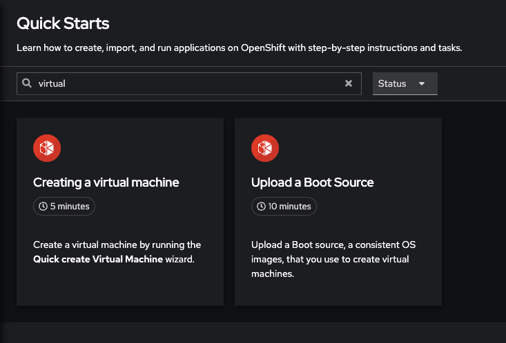
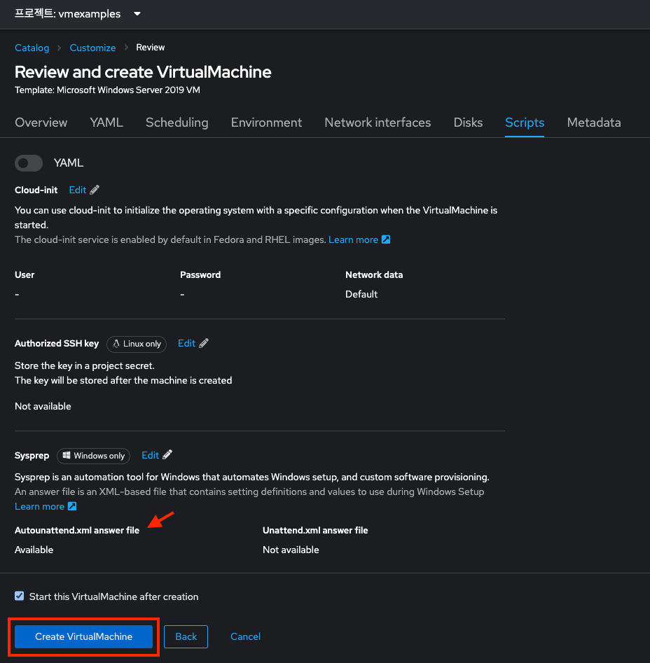

# 오픈시프트 가상화 기본

목차
1. [오픈시프트 가상화 개요(Overview) 대시보드](./openshift_virt_basic.md#1-오픈시프트-가상화-개요overview-대시보드)<br>
2. [가상머신 생성 및 관리](./openshift_virt_basic.md#2-가상머신-생성-및-관리)<br>
   2.1 [리눅스 가상머신 생성](./openshift_virt_basic.md#21-리눅스-가상머신-생성)<br>
   2.2 [가상머신 액세스](./openshift_virt_basic.md#22-가상머신-액세스)<br>
   &nbsp;&nbsp;&nbsp;&nbsp;&nbsp;2.2.1 [가상머신 콘솔 액세스](./openshift_virt_basic.md#221-가상머신-콘솔-액세스)<br>
   &nbsp;&nbsp;&nbsp;&nbsp;&nbsp;2.2.2 [가상머신과 연결된 리소스 검사](./openshift_virt_basic.md#222-가상머신과-연결된-리소스-검사)<br>
   2.3 [윈도우 가상머신 생성](./openshift_virt_basic.md#23-윈도우-가상머신-생성)<br>
3. [요약](./openshift_virt_basic.md#3-요약)
<br>

이 실습에서는 오픈시프트 가상화에서 가상머신을 생성하는 기본 사항을 소개합니다. 웹 콘솔을 통해 전체 프로세스를 안내하는 방법과 가상머신 속성을 검토하고 몇 가지 기본 사용자 지정을 수행하는 것이 얼마나 쉬운지 확인할 수 있습니다. 다음 실습에서는 가상머신을 좀 더 자세히 맞춤설정해 보겠습니다.

이 실습에서는 가상머신을 프로비저닝하는 두 가지 방법을 보여줍니다. 그러나 프로비저닝 방법은 다양하며 여기에 표시된 방법에만 국한되지는 않습니다. 가상머신을 프로비저닝 모든 방법으로 지원하는 운영체제에 적용할 수 있습니다.
<br>
<br>

## 1. 오픈시프트 가상화 Overview 대시보드

Overview 대시보드는 오픈시프트 가상화 및 가상머신의 상태에 대한 상태 정보와 함께 사용된 가상머신 및 리소스에 대한 클러스터 수준 보기를 제공합니다. 오픈시프트 가상화에서 일어나는 일을 빠르고 개괄적으로 파악하려는 관리자에게 유용한 시작점입니다.

1. 왼쪽 탐색 메뉴에서 **Virtualization** → **Overview**로 이동합니다. 
   </img> <br> 
   Overview 페이지는 오픈시프트 가상화 관리자에게 클러스터에 있는 가상머신의 글로벌 개요를 제공합니다. 일반 사용자는 자신의 프로젝트에 있는 가상머신만 볼 수 있습니다.

> [!NOTE]
> `Getting started resources` 패널이 표시되면, 해당 링크를 사용하여 가상머신을 생성하고 가상머신에 대한 사용자 지정 부팅 소스를 업로드하는 방법에 대한 단계별 안내를 하는 Quick Starts를 포함하여 오픈시프트 가상화에 대한 자세한 정보에 액세스할 수 있습니다. 패널 오른쪽 상단에 있는 점 3개 메뉴를 사용하여 패널을 숨길 수 있습니다. </img>
<br>

2. **Virtualization** → **Top consumers**를 검토합니다.
   
   페이지에서 아래로 스크롤하면 CPU, 메모리, 스토리지를 비롯한 다양한 리소스의 "최상위 소비자(Top consumers)"인 가상머신이 표시됩니다. 새로 생성된 클러스터에는 소비자가 없으므로 처음에는 볼 것이 거의 없습니다. "View virtualization dashboard"를 클릭하여 측정항목을 더 자세히 알아볼 수도 있습니다. 그러면 더 많은 데이터와 그래프가 포함된 KubeVirt 측정항목 대시보드가 표시됩니다.

   </img> <br> 

> [!IMPORTANT]
> 여기에 리소스가 표시되지 않으면 랩에서 가상머신이 시작되지 않은 것입니다. Overview 세부정보를 보려면 이 세그먼트 이후에 이 페이지를 다시 방문하세요.
<br>
<br>

## 2. 가상머신 생성 및 관리

가상머신 생성은 가상화 관리자가 가장 자주 수행하는 작업 중 하나입니다. 이 섹션에서는 미리 생성된 템플릿을 사용하여 새 가상머신을 생성하는 과정을 안내합니다. 가상화 관리자는 조직의 사용자 지정, 기본 가상머신 크기 조정 옵션, *cloud-init* 또는 *sysprep*을 사용한 추가 사용자 지정 옵션과 함께 게스트 운영체제 디스크를 사용하는 자체 템플릿을 생성할 수 있습니다.

이 랩에서는 레드햇 오픈시프트에서 가상머신을 실행하는 방법을 학습합니다. 오픈시프트 가상화의 기본 구성에 제공된 부팅 가능한 운영체제 디스크 이미지를 기반으로 새 가상머신을 생성합니다.

**목표**
* 새 가상머신 생성
* 가상머신 콘솔에 액세스
* 가상머신 콘솔을 사용해 경험 쌓기
<br>

### 2.1 리눅스 가상머신 생성

1. 왼쪽 메뉴에서 **Virtualization** → **VirtualMachines**로 이동합니다.
   
   </img> <br>

> [!NOTE]
> **Virtualization** 메뉴는 레드햇 오픈시프트 가상화가 설치되고 올바르게 구성된 경우에만 사용할 수 있습니다.
<br>

2. 가상머신이 없기 때문에 현재 비어 있는 것으로 **VirtualMachines** 대시보드가 표시되는지 확인합니다.
   
   </img> <br>
<br>

3. 가상머신을 만들기 전에 새 프로젝트를 만들어야 합니다. 가상머신은 기본적으로 네임스페이스에 대한 권한이 없는 사용자가 액세스, 관리 또는 제어할 수 없는 특정 프로젝트 또는 네임스페이스에 배포됩니다. 관리자는 모든 프로젝트에 액세스할 수 있으므로 모든 가상머신을 볼 수 있지만 일반 사용자에게는 필요에 따라 프로젝트에 대한 액세스 권한을 부여해야 합니다.

   1. **프로젝트: 모든 프로젝트**를 클릭한 다음 **프로젝트 만들기**를 클릭합니다.
      </img> <br> 

   2. **이름** 필드에 `vmexamples`를 입력하여 프로젝트 이름을 입력한 다음 **만들기** 를 클릭합니다.
      </img> <br> 
<br>

4. 프로젝트가 `vxexamples`인 것을 확인하고 **Create VirtualMachine**을 클릭합니다.

   </img> <br>

   사용 가능한 사전 정의된 가상머신 템플릿을 보여주는 대시보드가 나타납니다.
   </img> <br>
   사용 가능한 템플릿 목록을 검토하면 일부 템플릿에는 "Source available"을 나타내는 파란색 배지가 있음을 알 수 있습니다. 자동으로 다운로드되어 저장된 템플릿 디스크를 사용하는 템플릿입니다. 자체 환경에 배포하는 경우 이러한 소스 디스크가 생성되지 않도록 방지하고 해당 소스 디스크를 제거한 다음 조직을 위한 사용자 지정 디스크를 생성하고 업로드할 수 있는 옵션이 있습니다.
<br>

5. 찾기에서 fedora 입력하여 **Fedora VM** 타일을 선택합니다.

   </img> <br> 
<br>

6. **Fedora VM** 템플릿 대화 상자를 확인합니다.

   </img> <br> 
<br>

7. 이름을 `fedora01`로 변경하고 **Quick create VirtualMachine**을 누릅니다.

   </img> <br> 
<br>

8. 몇 초 후에 가상머신의 Status가 `Running`으로 바뀔 것 입니다. 이 시간 동안 스토리지 공급자는 새로 생성된 가상머신에서 사용할 수 있도록 템플릿 디스크를 복제했습니다. 소요되는 시간은 스토리지 제공업체에 따라 다릅니다.

   </img> <br> 
<br>

9. 가상머신이 생성된 후 **Events** 탭을 검사하여 프로세스의 일부 세부 정보를 확인합니다. 가상머신 생성에 문제가 있는 경우에 이 탭에 표시됩니다.

   </img> <br> 

   * *DataVolume*이 생성됩니다. *DataVolume*은 가상머신 디스크 생성을 관리하고 가상머신 생성 흐름 중에 오픈시프트 네이티브 스토리지에 대한 복제 또는 가져오기 프로세스를 추상화하는 데 사용됩니다.
   * 가상머신이 시작되었습니다.
<br>

10. **Details** 탭을 클릭하여 가상머신과 관련된 정보를 얻습니다. 이 템플릿의 경우 기본값은 CPU 1개와 메모리 2GiB입니다. 관리자는 가상머신의 기본 구성을 사용자 정의하는 템플릿을 생성할 수 있습니다.

    SDN(소프트웨어 정의 네트워크)에 있는 가상머신의 IP 주소, 부팅 순서, 워크로드 프로필, 가상 머신을 호스팅하는 클러스터 노드 등에 대한 정보들이 함께 여기에 표시됩니다.

    </img> <br> 
<br>

### 2.2 가상머신 액세스

#### 2.2.1 가상머신 콘솔 액세스

1. **Console** 탭을 클릭하여 가상머신 콘솔에 액세스합니다.

   </img> <br> 
<br>

2. `fedora` 사용자의 생성된 비밀번호를 보려면 **Guest login credentials**을 클릭합니다. 이는 오픈시프트 가상화의 기본 템플릿에서 제공되는 cloud-init를 사용하여 비밀번호를 설정한, 사용자 정의 가상머신의 경우에만 표시됩니다.

   </img> <br> 
<br>

3. `fedora` 사용자와 표시된 비밀번호를 사용하여 가상머신에 로그인합니다.

   </img> <br> 

> [!IMPORTANT]
> 비밀번호를 복사한 후 `붙여넣기(Paste)`를 클릭하여 비밀번호를 붙여넣을 수 있습니다.

> [!IMPORTANT]
> `붙여넣기(Paste)` 기능이 작동하지 않으면 콘솔 입력이 US 키맵을 사용하고 있다는 점을 고려하십시오. 한 가지 작은 요령은 올바른 문자(특히 `-` 문자가 올바른지)를 쓰고 있는지 확인하기 위해 로그인에 비밀번호를 쓰는 것입니다.
<br>

4. 로그인한 후 `ip a` 명령을 실행하여 인터페이스와 IP 주소를 표시합니다.

   </img> <br> 

   가상머신의 네트워크 어댑터는 SDN에 연결되어 있으므로 할당된 IP 주소는 *KVM 하이퍼바이저*에서 사용하는 내부 IP 주소이며 외부에서 액세스할 수 있는 IP가 아닙니다. 가상머신이 다른 노드로 라이브 마이그레이션되고 SDN에 연결된 외부 IP가 변경되더라도 가상머신의 IP는 변경되지 않습니다.
<br>

5. `lsblk`를 실행하여 디스크 목록과 해당 용량, 여유 공간을 표시합니다.

   </img> <br> 

   * `/dev/vda`는 가상머신 생성 중에 생성된 디스크이며 생성 시 지정된 크기입니다.
   * `/dev/vdb`는 `cloud-init`으로 필수 데이터(예: `fedora` 사용자 비밀번호 등) 구성에 사용됩니다. 이 디스크는 가상머신이 생성된 후 제거될 수 있습니다.
<br>

6. `nproc` 및 `free -m` 명령을 사용하여 가상머신과 연결된 CPU 수 및 메모리 양(생성 중에 지정된 flavor와 일치)을 검사합니다.

   </img> <br> 
<br>

7. 게스트 사용자 정의를 검토하려면 `cloud-init` 디스크를 마운트합니다.

   </img> <br> 
<br>

8. 하이퍼바이저에 인스턴스는 정보를 표시하고 인스턴스의 디스크 정지와 같은 작업을 조정하기 위해 게스트 에이전트를 실행 중입니다.

   </img> <br> 
<br>

9. **Overview** 탭을 클릭하여 게스트 가상머신에서 얻은 정보를 표시합니다.

   </img> <br> 

   * 호스트 이름
   * 운영체제 버전 및 타임존 정보
   * 액티브 사용자
   * 사용량: CPU, 메모리, 스토리지 및 네트워크
<br>

10. **Metrics** 탭으로 이동하여 시간 범위 지정 등을 통해 사용량에 대한 추가 정보를 얻을 수 있습니다.

    </img> <br> 
<br>

#### 2.2.2 가상머신과 연결된 리소스 검사

**Configuration** 탭은 가상머신의 리소스에 대한 정보를 얻기 위한 진입점입니다. 여기에는 5개의 하위 탭이 포함되어 있습니다.

</img> <br> 

* **Scheduling**: 가상머신이 실행되어야 하는 위치와 제거를 위해 따라야 할 전략을 나타내는 고급 구성이 포함됩니다. 이는 (반)친화성[(anti)affinity] 규칙을 구성하고, 노드 선택기(selector)와 허용 오차를 구성하고, 가상머신을 예약할 수 있는 클러스터 노드에 영향을 미치는 기타 동작을 구성하는 데 사용됩니다.
* **Environment**: *ConfigMap*, *Secret*, *서비스 계정(Service Accounts)* 을 추가 디스크로 연결할 수 있습니다. 이는 가상머신에서 실행 중인 애플리케이션에 구성 데이터를 전달할 때 유용합니다.
* **Network interfaces**: 가상머신에 대해 구성된 현재 네트워크 인터페이스를 표시하고 새 네트워크 인터페이스를 추가합니다.
* **Disks**: 시스템에 연결된 디스크를 나열하고 시스템에 새 디스크를 추가할 수 있습니다. 게스트가 에이전트로 구성된 경우 파일 시스템과 활용도가 나열됩니다.
* **Scripts**: 이 탭을 사용하면 SSH 키 삽입, 애플리케이션 설치, 네트워크 구성 등과 같이 첫 번째 부팅 시 실행할 명령 설정을 포함하여 리눅스 용 *cloud-init* 또는 마이크로소프트 용 *sys-prep*을 구성할 수 있습니다.
<br>

1. **Network interfaces** 하위 탭을 클릭하여 가상머신에 연결된 네트워크 인터페이스를 검사합니다.

   </img> <br>

   가상머신이 생성되면 기본적으로 `masquerade` 유형의 `PodNetworking` 네트워크 인터페이스가 생성됩니다. 이는 가상머신을 SDN에 연결하고 가상머신에서 오픈시프트 클러스터 외부로의 액세스를 제공합니다. 클러스터의 다른 가상머신 및 Pod는 이 인터페이스를 사용하여 가상머신에 액세스할 수 있습니다. 또한 SDN에 연결된 가상머신은 경로 또는 로드 밸런서를 사용하여 외부에서 액세스할 수 있지만 이 워크숍에서는 이에 대해 다루지 않습니다.
<br>

2. **Disks** 하위 탭을 클릭하여 가상머신과 연결된 디스크를 나열합니다.

   </img> <br> 

   이 환경에서 디스크에 사용되는 저장소의 소스와 유형을 정의하는 기본 StorageClass를 `ocs-storagecluster-ceph-rbd`라고 합니다. 이 스토리지는 ODF(OpenShift Data Foundation)에서 제공하는 기본 유형입니다. 각 스토리지 제공자에는 가상머신 디스크를 지원하는 스토리지의 특성을 정의하는 다양한 스토리지 클래스가 있습니다.
<br>

### 2.3 윈도우 가상머신 생성

이 번 랩에서는 웹 서버에서 호스팅되는 ISO를 사용하여 마이크로스프트 윈도우 서버 2019를 설치합니다. 이는 웹 서버, 개체 스토리지 또는 클러스터의 기타 영구 볼륨을 비롯한 여러 위치에서 디스크를 소싱하는 기능을 활용하는 가상머신에 운영체제를 설치하는 한 가지 방법을 나타냅니다.

이 프로세스는 초기 운영체제 설치 후 가상머신에서 템플릿을 생성하여 간소화할 수 있습니다. 템플릿으로 사용할 게스트 운영체제를 준비하는 구체적인 프로세스는 다양하므로 템플릿 운영체제를 준비할 때 조직의 지침 및 요구 사항을 따르십시오.
<br><br>

1. 왼쪽 메뉴에서 **Virtualization** → **VirtualMachines**로 이동합니다.

   </img> <br>
<br>

2. 현재 프로젝트에서 실행 중인 가상머신이 나열됩니다.

   </img> <br>
<br>

3. 오른쪽 상단의 **Create** 버튼을 누르고 템플릿에서 선택합니다.

   </img> <br>
<br>

4. 검색 창에 *windows server* 입력 후 나타난 템플릿 중에 **Microsoft Windows Server 2019 VM** 타일을 선택합니다.

   </img> <br>
<br>

5. 템플릿과 관련된 기본 구성을 보여주는 대화 상자가 나타납니다.

   </img> <br>
<br>

6. **Customize VirtualMachine**을 눌러 프로비저닝에 사용할 매개변수를 지정하는 대화 상자를 확인합니다.

   </img> <br>
<br>

7. 이 대화 상자에서 **Name** 필드에 `windows`로 이름을 입력합니다.
   
   </img> <br>
<br>

8. **Storage** 섹션에서 다음을 지정합니다.
   
   </img> <br>

   1. `Boot from CD` 체크박스를 활성화
   2. **CD Source**를 URL로 선택
   3. **Image URL**에 *http://192.168.123.100:81/Windows2019.iso* 를 입력
   4. **Disk size**를 **5GiB**로 설정하여 CD 크기를 줄임
<br>

9. **Disk source**를 그대로 두고 하단의 **Disk size**의 값도 기본값인 **60GiB**로 유지합니다.

   </img> <br>
<br>

10. `Mount Windows drivers disk`가 활성화되어 있는지 확인합니다. 이는 VirtIO용 드라이버를 제공하는 윈도우 시스템을 설치하는 데 필요합니다.

    </img> <br>
<br>

11. 매개변수를 입력이 완료되면 **Next**를 누릅니다.

    </img> <br>
<br>

12. **Scripts** 탭으로 전환하고 `Sysprep` 섹션에서 **Edit**를 누릅니다.

    </img> <br>
<br>

13. **Autounattend.xml answer file** 양식을 `autounattend.xml`의 코드로 채웁니다.

    </img> <br>

    `autounattend.xml` 파일   
    ```xml
    <?xml version="1.0" encoding="utf-8"?>
    <unattend xmlns="urn:schemas-microsoft-com:unattend" xmlns:wcm="http://schemas.microsoft.com/WMIConfig/2002/State" xmlns:xsi="http://www.w3.org/2001/XMLSchema-instance" xsi:schemaLocation="urn:schemas-microsoft-com:unattend">
      <settings pass="windowsPE">
        <component name="Microsoft-Windows-Setup" processorArchitecture="amd64" publicKeyToken="31bf3856ad364e35" language="neutral" versionScope="nonSxS">
          <DiskConfiguration>
            <Disk wcm:action="add">
              <CreatePartitions>
                <CreatePartition wcm:action="add">
                  <Order>1</Order>
                  <Extend>true</Extend>
                  <Type>Primary</Type>
                </CreatePartition>
              </CreatePartitions>
              <ModifyPartitions>
                <ModifyPartition wcm:action="add">
                  <Active>true</Active>
                  <Format>NTFS</Format>
                  <Label>System</Label>
                  <Order>1</Order>
                  <PartitionID>1</PartitionID>
                </ModifyPartition>
              </ModifyPartitions>
              <DiskID>0</DiskID>
              <WillWipeDisk>true</WillWipeDisk>
            </Disk>
          </DiskConfiguration>
          <ImageInstall>
            <OSImage>
              <InstallFrom>
                <MetaData wcm:action="add">
                  <Key>/IMAGE/NAME</Key>
                  <Value>Windows Server 2019 SERVERSTANDARD</Value>
                </MetaData>
              </InstallFrom>
              <InstallTo>
                <DiskID>0</DiskID>
                <PartitionID>1</PartitionID>
              </InstallTo>
            </OSImage>
          </ImageInstall>
          <UserData>
            <AcceptEula>true</AcceptEula>
            <FullName>Administrator</FullName>
            <Organization>My Organization</Organization>
          </UserData>
          <EnableFirewall>false</EnableFirewall>
        </component>
        <component name="Microsoft-Windows-International-Core-WinPE" processorArchitecture="amd64" publicKeyToken="31bf3856ad364e35" language="neutral" versionScope="nonSxS">
          <SetupUILanguage>
            <UILanguage>en-US</UILanguage>
          </SetupUILanguage>
          <InputLocale>en-US</InputLocale>
          <SystemLocale>en-US</SystemLocale>
          <UILanguage>en-US</UILanguage>
          <UserLocale>en-US</UserLocale>
        </component>
      </settings>
      <settings pass="offlineServicing">
        <component name="Microsoft-Windows-LUA-Settings" processorArchitecture="amd64" publicKeyToken="31bf3856ad364e35" language="neutral" versionScope="nonSxS">
          <EnableLUA>false</EnableLUA>
        </component>
      </settings>
      <settings pass="specialize">
        <component name="Microsoft-Windows-Shell-Setup" processorArchitecture="amd64" publicKeyToken="31bf3856ad364e35" language="neutral" versionScope="nonSxS">
          <AutoLogon>
            <Password>
              <Value>R3dh4t1!</Value>
              <PlainText>true</PlainText>
            </Password>
            <Enabled>true</Enabled>
            <LogonCount>999</LogonCount>
            <Username>Administrator</Username>
          </AutoLogon>
          <OOBE>
            <HideEULAPage>true</HideEULAPage>
            <HideLocalAccountScreen>true</HideLocalAccountScreen>
            <HideOnlineAccountScreens>true</HideOnlineAccountScreens>
            <HideWirelessSetupInOOBE>true</HideWirelessSetupInOOBE>
            <NetworkLocation>Work</NetworkLocation>
            <ProtectYourPC>3</ProtectYourPC>
            <SkipMachineOOBE>true</SkipMachineOOBE>
          </OOBE>
          <UserAccounts>
            <LocalAccounts>
              <LocalAccount wcm:action="add">
                <Description>Local Administrator Account</Description>
                <DisplayName>Administrator</DisplayName>
                <Group>Administrators</Group>
                <Name>Administrator</Name>
              </LocalAccount>
            </LocalAccounts>
          </UserAccounts>
          <TimeZone>Eastern Standard Time</TimeZone>
        </component>
      </settings>
      <settings pass="oobeSystem">
        <component name="Microsoft-Windows-International-Core" processorArchitecture="amd64" publicKeyToken="31bf3856ad364e35" language="neutral" versionScope="nonSxS">
          <InputLocale>en-US</InputLocale>
          <SystemLocale>en-US</SystemLocale>
          <UILanguage>en-US</UILanguage>
          <UserLocale>en-US</UserLocale>
        </component>
        <component name="Microsoft-Windows-Shell-Setup" processorArchitecture="amd64" publicKeyToken="31bf3856ad364e35" language="neutral" versionScope="nonSxS">
          <AutoLogon>
            <Password>
              <Value>R3dh4t1!</Value>
              <PlainText>true</PlainText>
            </Password>
            <Enabled>true</Enabled>
            <LogonCount>999</LogonCount>
            <Username>Administrator</Username>
          </AutoLogon>
          <OOBE>
            <HideEULAPage>true</HideEULAPage>
            <HideLocalAccountScreen>true</HideLocalAccountScreen>
            <HideOnlineAccountScreens>true</HideOnlineAccountScreens>
            <HideWirelessSetupInOOBE>true</HideWirelessSetupInOOBE>
            <NetworkLocation>Work</NetworkLocation>
            <ProtectYourPC>3</ProtectYourPC>
            <SkipMachineOOBE>true</SkipMachineOOBE>
          </OOBE>
          <UserAccounts>
            <LocalAccounts>
              <LocalAccount wcm:action="add">
                <Description>Local Administrator Account</Description>
                <DisplayName>Administrator</DisplayName>
                <Group>Administrators</Group>
                <Name>Administrator</Name>
              </LocalAccount>
            </LocalAccounts>
          </UserAccounts>
          <TimeZone>Eastern Standard Time</TimeZone>
        </component>
      </settings>
    </unattend>
    ```
<br>

14. 대화 상자에서 **저장(Save)** 을 클릭합니다.

    </img> <br>
<br>

15. **Autounattend.xml answer file**에 설정된 값을 확인 후 **Create VirtualMachine**을 누릅니다.

    </img> <br>
<br>

16. 가상머신은 ISO 이미지를 다운로드하고 인스턴스를 구성 및 시작하여 프로비저닝 프로세스를 시작합니다.

    </img> <br>
<br>

17. 몇 분 후에 가상머신의 Status 값이 `Running`으로 바뀝니다. **Console** 탭으로 전환합니다.

    </img> <br>

> [!NOTE]
> 이 워크숍에서는 설치가 완료될 때까지 기다릴 필요가 없습니다. 다음 모듈을 계속 진행할 수 있습니다.

> [!IMPORTANT]
> CD-ROM 디스크가 연결되어 있으므로 가상머신은 "마이그레이션할 수 없음(Not migratable)"으로 표시됩니다.
<br>
<br>

## 3. 요약

이 실습에서는 오픈시프트 가상화에서 제공하는 사전 구성된 PVC를 사용하여 가상머신을 생성했습니다. 그런 다음 가상머신 속성을 탐색하고 기본 제공 콘솔을 사용하여 가상머신에 연결했습니다.

그런 다음 네트워크 상에 위치한 ISO 디스크 이미지를 사용하여 새 윈도우 가상머신을 만들었습니다.

다음 실습인 가상 머신 사용자 지정 실습으로 계속 진행하여 생성 중에 가상머신을 사용자 지정하고 가상머신을 관리할 수 있습니다.
<br>
<br>

HOWTO GET virtctl
```bash
wget --no-check-certificate https://hyperconverged-cluster-cli-download-openshift-cnv.apps.ocp.example.com/amd64/linux/virtctl.tar.gz
```
------
[차례](../README.md) &nbsp;&nbsp;&nbsp;&nbsp; [<< 랩 환경 <<](./lab_review.md) &nbsp;&nbsp;&nbsp;&nbsp; [>> 오픈시프트 가상화 커스터마이징 >>](./openshift_virt_customization.md)
