# 오픈시프트 가상화 커스터마이징

목차
1. [가상머신 사용자 정의 소개](./openshift_virt_customization.md#1-가상머신-사용자-정의-소개) 
2. [가상머신 생성](./openshift_virt_customization.md#2-가상머신-생성) 
3. [요약](./openshift_virt_customization.md#3-요약)
 

## 1. 가상머신 사용자 정의 소개

이 실습에서는 외부 웹 서버에서 호스팅되는 사용자 지정 템플릿 디스크 사용, 리소스 속성 설정, cloud-init에서 구성한 비밀번호 지정 등을 포함하여 생성 시에 가상 머신을 사용자 정의합니다.

**목표**
* QCOW2 이미지에서 가상머신을 생성합니다.
* 가상머신 생성 마법사를 사용하여 가상머신을 사용자 정의합니다.
 
 

## 2. 가상머신 생성

이전 실습에서 이미 Fedora 가상머신을 생성했습니다. 이번에는 몇 가지 다른 설정으로 가상머신을 사용자 정의합니다. 예를 들어, `fedora` 사용자에 대한 사용자 정의 비밀번호를 설정합니다.

> [!NOTE]
> `fedora` 사용자는 이 워크숍에서 사용되는 [Fedora 클라우드 이미지](https://github.com/rhpds/roadshow_ocpvirt_instructions/blob/summit/workshop/content/04_ocpv_customization.adoc#:~:text=configured%20by%20the-,Fedora%20Cloud%20image,-used%20in%20this)에 의해 구성된 기본 사용자입니다. 조직에서 생성하고 사용하는 템플릿은 다른 사용자 이름을 사용하거나 cloud-init 또는 SysPrep을 사용하여 게스트 운영체제를 ID 공급자에 자동으로 연결할 수 있습니다.
 

1. **Virtualization** → **Overview**로 이동합니다.
   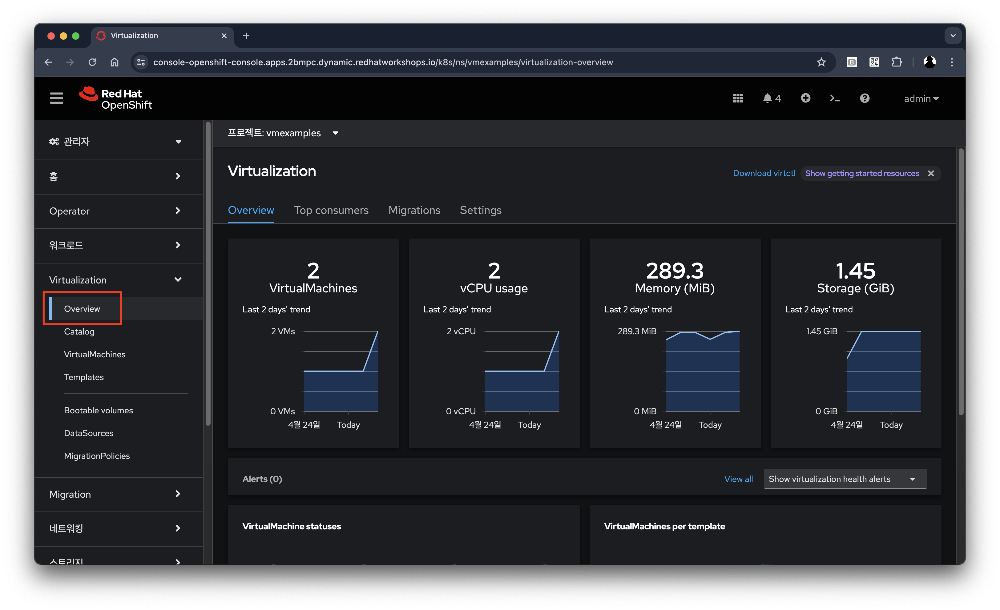</img>   
   이전 단계에서 가상머신을 생성했으므로 이제 이 대시보드에서 해당 가상머신이 사용하는 리소스를 볼 수 있습니다.
 

2. 왼쪽 메뉴에서 **Virtualization** → **VirtualMachines**으로 돌아  갑니다.

   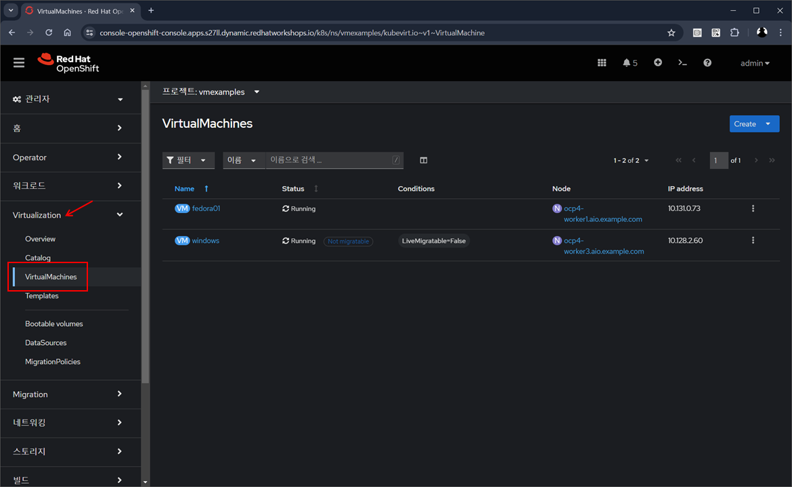</img>   

> [!NOTE]
> 이전 페이지에서 생성된 가상머신이 표시되지 않으면 패널 왼쪽 상단에 있는 `vmexamples` 프로젝트가 표시되는지 다시 확인하세요.
 

3. 오른쪽 상단 드롭다운에서 **Create** → **From template**을 선택합니다.

   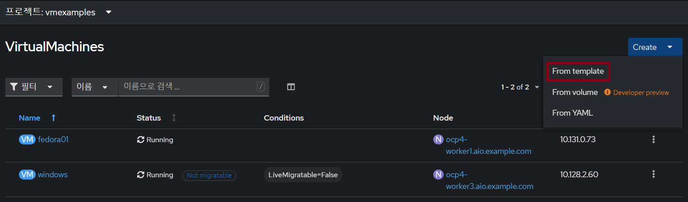</img>   
 

4. 검색 창에 **fedora**를 입력하여 나타난 사전 정의된 템플릿 **Fedora VM** 타일을 선택합니다.

   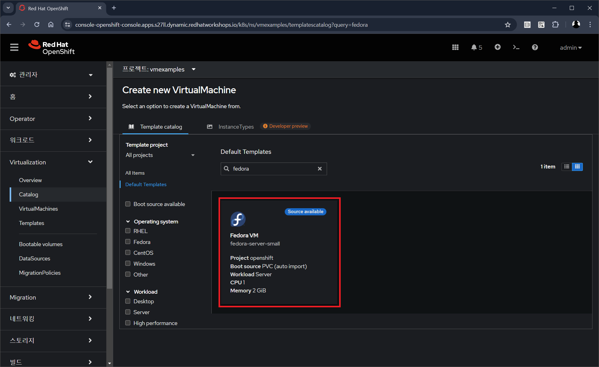</img>  
 

5. 열린 대화 상자에서 **Customzie VirtualMachine**을 클릭합니다.

   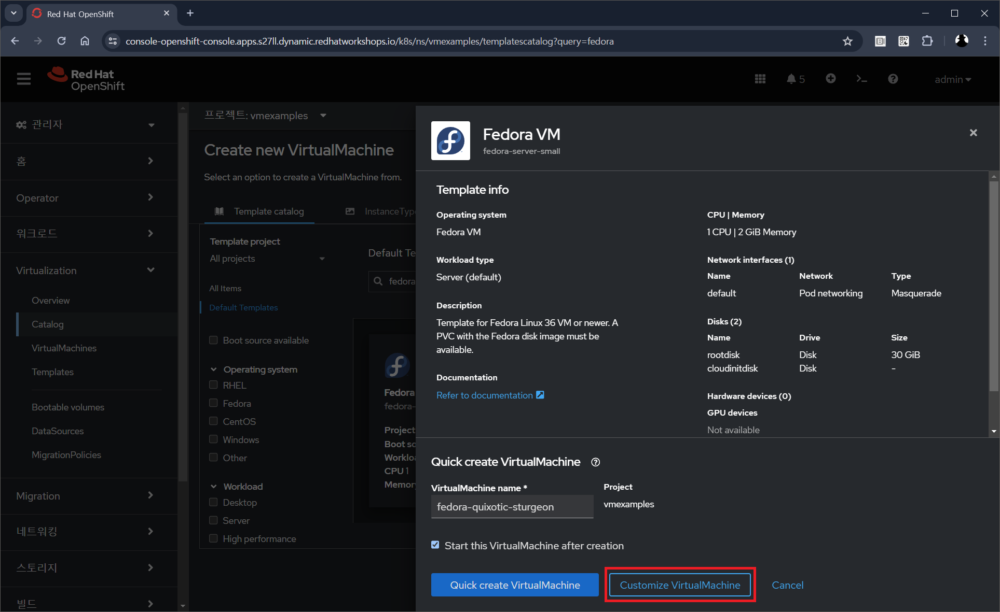</img>  
 

6. 가상 머신 사용자 정의

   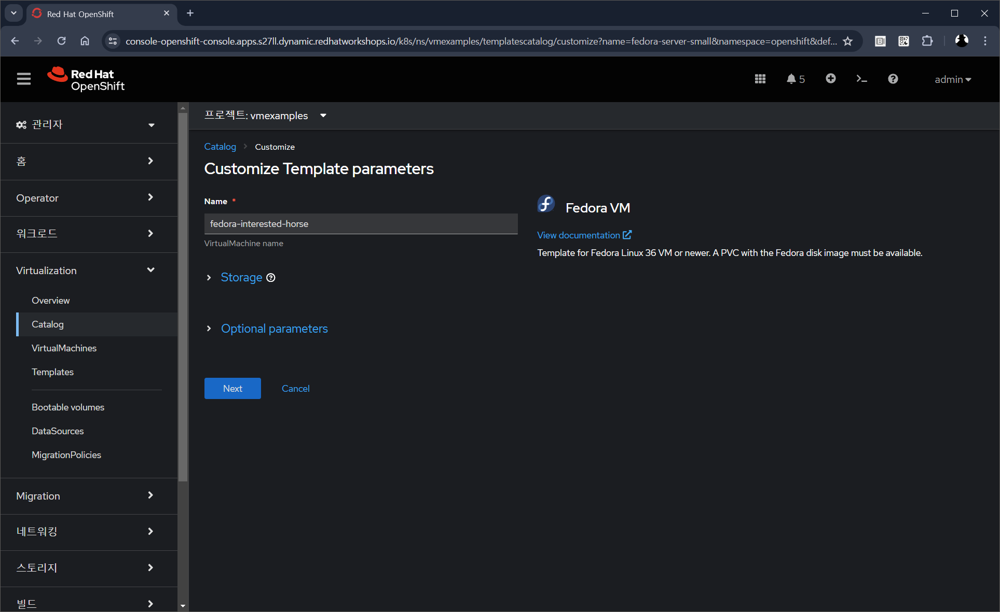</img>  
   이 템플릿에는 이미 사용 가능한 디스크가 있지만 외부 웹 서버에서 다른 디스크를 가져오고 싶습니다. 이는 디스크 라이브러리에서 가상머신을 배포하기 위한 한 가지 옵션이지만 스토리지 공급자에 의존하여 디스크용 PVC 클론을 오프로드하는 것보다 느릴 수 있습니다. 여기에 사용된 QCOW2 디스크 이미지를 PVC로 가져와 가상머신 클론용 소스 디스크로 사용할 수도 있습니다. 이를 수행하는 방법에 대한 자세한 내용은 [설명서](https://docs.openshift.com/container-platform/4.13/virt/virtual_machines/importing_vms/virt-importing-virtual-machine-images-datavolumes.html)를 참조하십시오.
   
   1. 이름을 `fedora02`로 지정
      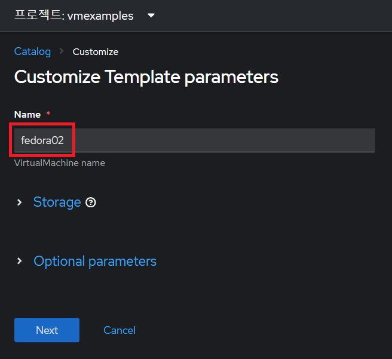</img>  

   2. **Storage** 섹션에서 다음을 수행
      * **Disk Source**: URL (PVC를 생성하는)
      * **URL**: http://192.168.123.100:81/Fedora35.qcow2
      * **Disk size**: 30GiB
      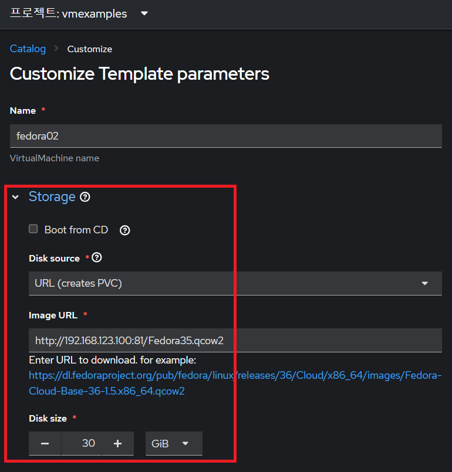</img>  

   3. 설정 후 **Next**를 클릭합니다.
 

7. 템플릿의 기본 구성으로 **Overview** 탭을 검토합니다.

   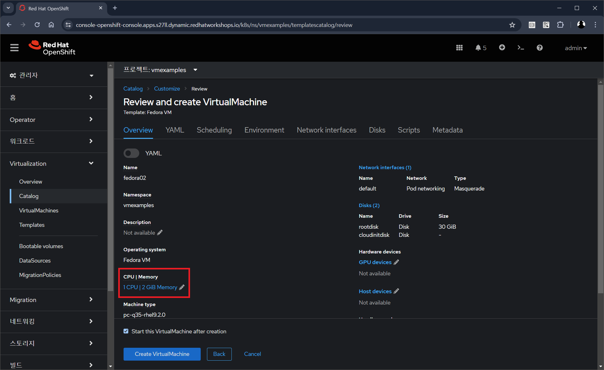</img>  
 

8. 가상 머신의 리소스 할당을 조정하기 위해 **CPU | Memory** 링크를 클릭하고, CPU 수를 2로, 메모리를 4GiB로 변경합니다.

   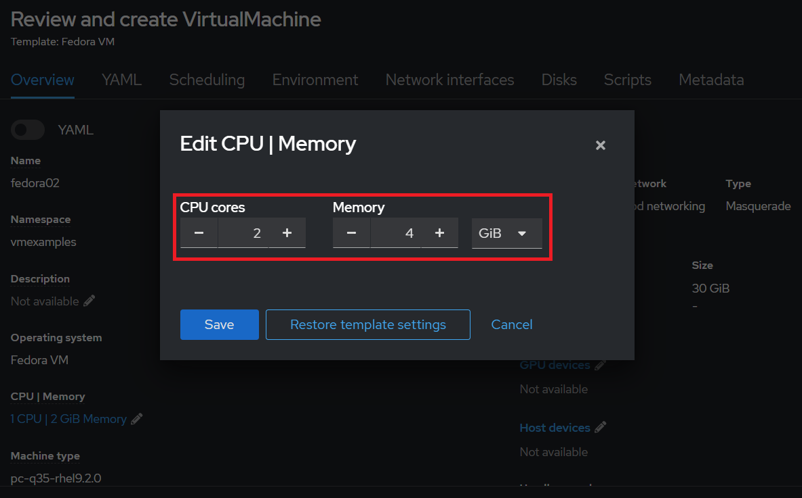</img>  
   변경 후 **Save**를 누릅니다.
 

9. **Scheduling** 탭으로 이동하여 수정하지 않고 사용 가능한 옵션을 검토합니다.

   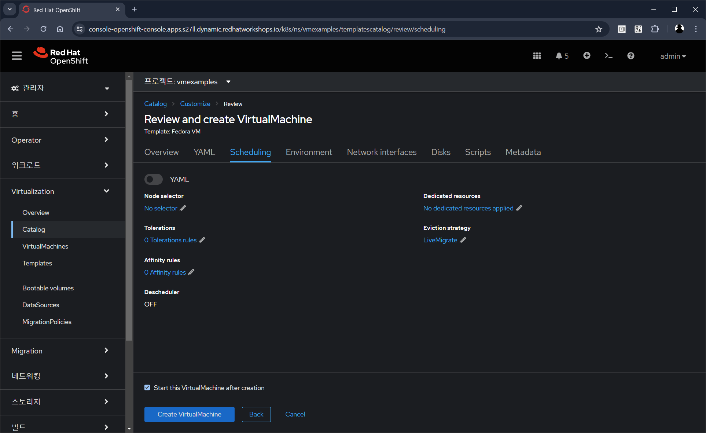</img>  

   * **Node selector**는 가상머신이 실행될 수 있는 하나 이상의 클러스터 노드를 지정하는 데 사용됩니다. 이름, 레이블 또는 주석별로 선택할 수 있습니다.
   * **Tolerations**는 클러스터 노드에 taint(손상/오염)이 적용된 경우에 사용됩니다. Taint(손상/오염)은 이를 허용하는 특정 워크로드만 노드에서 실행되도록 허용해야 함을 나타내는 지표입니다. 예를 들어 GPU가 있는 노드가 일부만 있는 경우에, GPU를 사용하는 가상머신만 해당 노드에서 실행할 수 있도록 하는 경우에 유용합니다.
   * **Affinity rules**은 가상머신이 다른 워크로드와 함께 예약되어야 하는지 또는 반대의 선호도(antiaffinity) 규칙의 경우 다른 워크로드와 함께 예약되지 않아야 하는지를 나타내는 데 사용됩니다.
   * **Dedicated resources** 기능은 예를 들어 PCIe 장치를 가상머신에 할당하거나 특정 CPU 코어를 가상머신에 할당하려는 경우에 사용됩니다.
   * 기본적으로 모든 가상머신은 Live Migrate **Eviction strategy**을 사용합니다. 즉, 업데이트 적용과 같은 유지 관리 목적으로 노드가 차단되고 비워지면 가상머신이 중단 없이 다른 노드로 마이그레이션됩니다. 또는 가상머신을 종료하고 콜드 마이그레이션을 수행하거나 전혀 마이그레이션하지 않도록 구성할 수 있습니다.
   * **Descheduler**는 가상머신과 이를 실행 중인 호스트를 주기적으로 평가하여 다른 호스트로 마이그레이션해야 하는지 결정하는 오픈시프트의 기능입니다. 이는 리소스 최적화 이유나 선호도 규칙 위반 때문일 수 있습니다.
 

10. **Network Interfaces** 탭으로 이동하여 기본적으로 가상머신이 `Pod networking`(오픈시프트 내부 네트워킹)에 연결되어 있는지 확인합니다.

    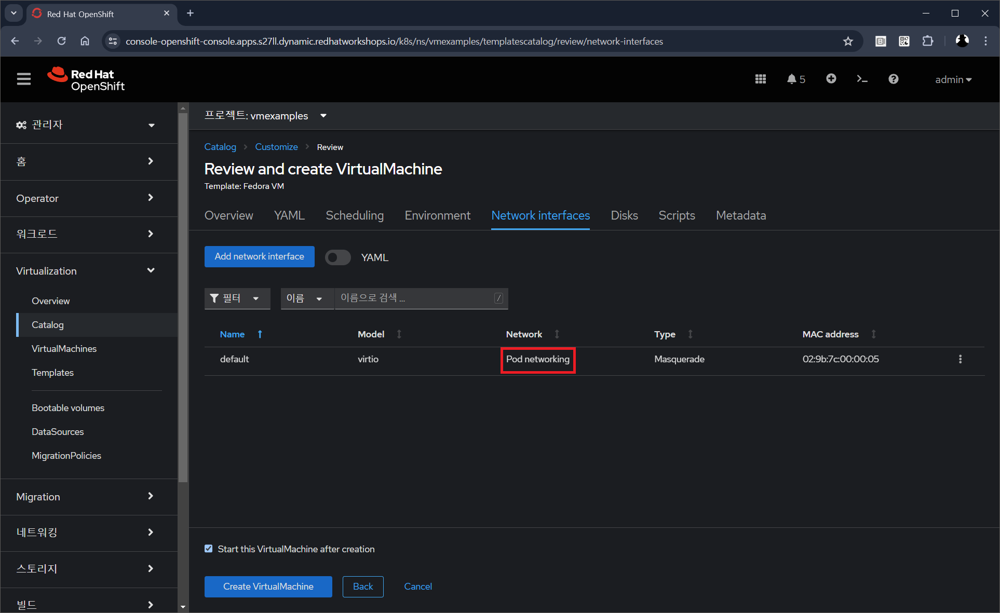</img>  
 

11. 세 개의 수직 점 아이콘을 클릭하여 `default`을 편집하고 기본 옵션을 검토합니다.

    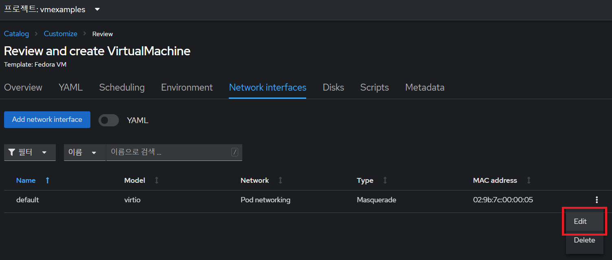</img>  

    **Edit network interface** 대화창을 확인합니다.
    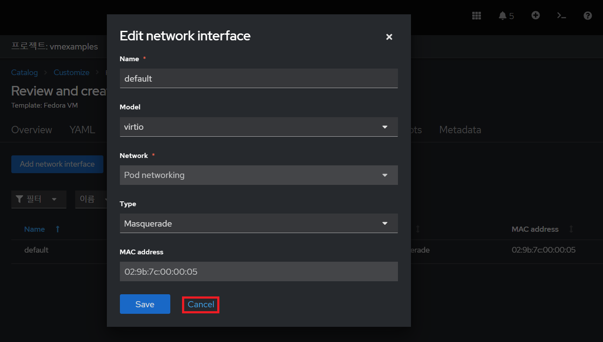</img>  

    * **Model**은 사용될 네트워크 어댑터의 유형을 나타냅니다. `virtio`는 반가상화 NIC인 반면 e1000 및 기타는 에뮬레이트된 장치입니다.
    * 사용 가능한 다른 네트워크가 없기 때문에 **네트워크(Network)** 가 회색으로 표시됩니다. 이 워크숍의 향후 모듈에서는 가상머신용 추가 네트워크를 추가하고 이를 사용하겠습니다.
    * **Type**은 가상머신을 네트워크에 연결하는 방법을 나타냅니다. SDN 또는 *Pod networking*의 경우 `Masquerade`로 설정됩니다. VLAN 네트워크의 경우 `브리지(Bridge)` 설정이 사용됩니다.
    * 새로 생성된 NIC의 경우 할당된 **MAC address**를 사용자 정의할 수 있는 옵션이 있습니다. 이미 생성된 NIC를 편집하고 있기 때문에 여기서는 회색으로 표시됩니다.

    현재 사용 가능한 다른 네트워크가 없으므로 `Cancel`를 눌러 대화 상자를 종료하세요.
 

12. **Disks** 탭으로 이동하여 가상머신에 할당된 장치를 확인합니다.

    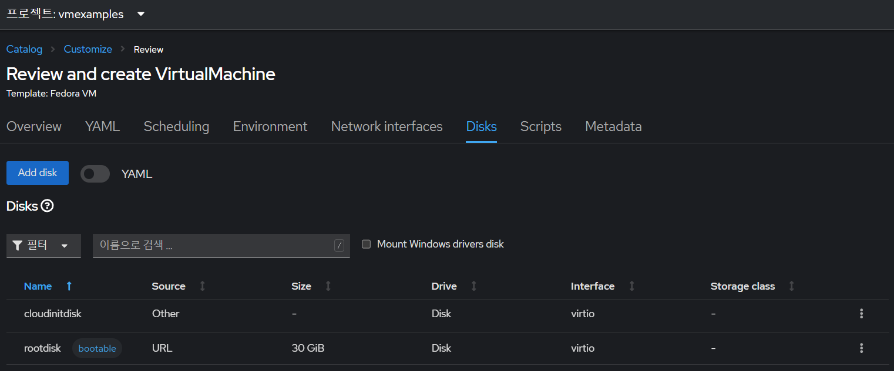</img>  

    가상머신을 만들기 전에 새 디스크를 추가하고 기본 디스크를 수정할 수 있습니다. 또한 *Storage class*와 부팅 *Source*(예: ISO에서 부팅)를 수정하고 *Interface*를 기본 `virtio`로 사용하는 대신 디스크 인터페이스를 정의할 수 있습니다.
 

13. 세 개의 수직 점 아이콘을 클릭하여 `루트디스크(rootdisk)`를 편집하고 기본 옵션을 검토합니다.

    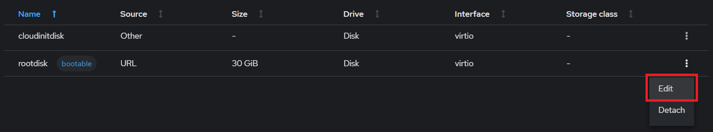</img>  
    
    **Edit disk** 대화창에 다음 값을 입력합니다.
    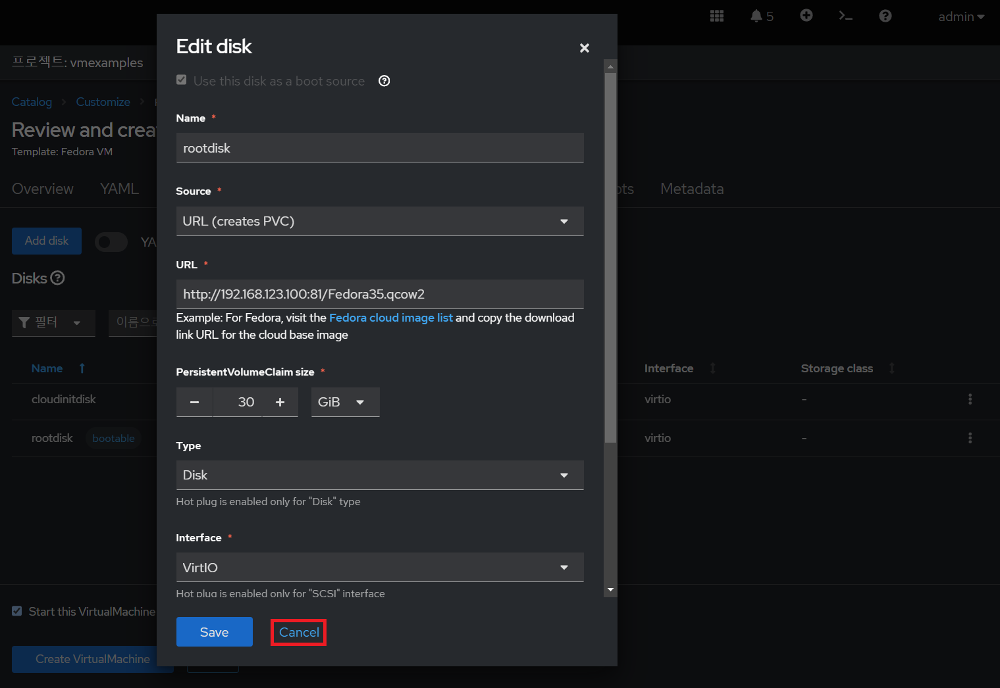</img>  

    * **PertantVolumeClaim size**는 가상머신에 연결된 디스크의 크기입니다. 디스크 소스가 다른 PVC인 경우 소스보다 작을 수 없습니다. 그렇지 않으면 가져오는 QCOW2 또는 ISO를 저장할 수 있을 만큼 충분히 큰지 확인해야 합니다.
    * 디스크 **Type**은 예를 들어 CD-ROM 장치로 변경될 수 있습니다.
    * 각 디스크는 **Interface**를 사용하여 가상머신에 연결됩니다. `VirtIO` 인터페이스는 KVM 반가상화 인터페이스 유형입니다.
    * **StorageClass**는 VM 디스크를 지원하는 스토리지 유형을 나타냅니다. 이는 스토리지 제공자마다 다르며 일부 스토리지 제공자는 다양한 기능, 성능 및 기타 기능을 나타내는 여러 스토리지 클래스를 가질 수 있습니다.
    * **Apply optimized StorageProfile Settings**은 스토리지 유형에 표시된 복제 전략 및 볼륨 모드를 사용함을 나타냅니다. 레드햇에서 많은 CSI 제공업체를 위해 제공하지만 사용 사례에 맞게 사용자 정의할 수도 있습니다.

    확인 후 **Cancel**은 누릅니다.
 

14. **스크립트(Scripts)** 탭으로 이동합니다. 이 탭은 배포 시 cloud-init 또는 Sysprep과 같은 게스트 운영체제 사용자 지정을 적용하는 데 사용됩니다.

    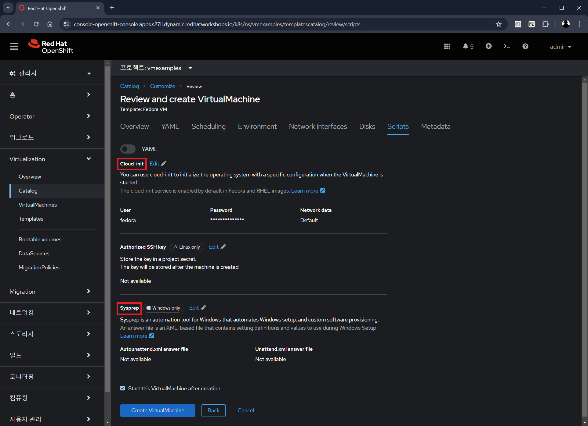</img>  

    * **Cloud-init**는 GUI 대화 상자를 사용하거나 고급 구성을 위해 표준 YAML 스크립트를 사용하여 구성할 수 있습니다. 다음 단계에서는 이 정보를 설정 하겠습니다.
    * 선택적으로 한 명 이상의 사용자가 암호 없이 가상머신에 연결할 수 있도록 **Authorized SSH key**가 제공될 수 있습니다. 이 SSH 키는 `시크릿(Secret)`로 저장될 수 있으며 원하는 경우 새 리눅스 가상머신에 자동으로 적용될 수 있습니다.
    * **Sysprep**은 호스트 이름, 기본 `관리자(Administrator)` 암호 및 Active Directory 도메인 가입과 같은 구성 설정을 포함하여 새 운영체제 배포를 자동으로 구성하기 위한 마이크로소프트 윈도우 도구입니다.
 

15. Fedora 가상머신을 위해 **Cloud-init** 섹션에서 **Edit**을 누릅니다.

    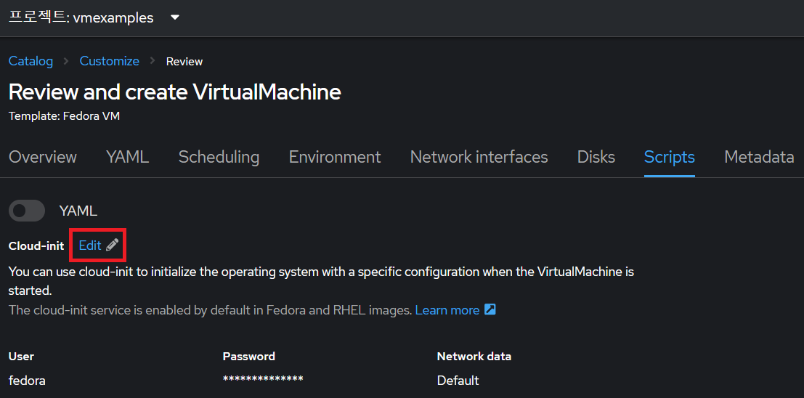</img>  
    
    `fedora` 사용자의 비밀번호 `ocpVirtIsGre@t`를 지정합니다. 완료되면 **Apply**를 클릭하세요.
    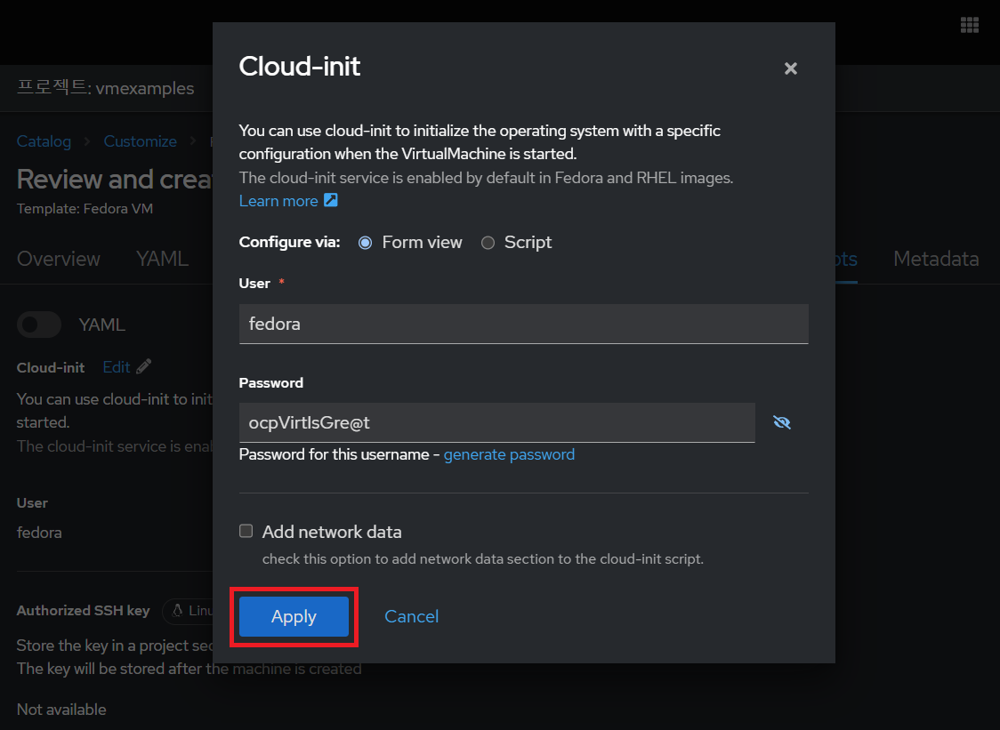</img>  
    여기서 해당 상자를 선택하여 네트워크 구성 정보를 지정할 수도 있습니다. 예를 들어 가상머신을 VLAN 네트워크에 직접 연결하고 고정 IP 주소를 구성하려는 경우에 유용합니다.
 

16. **Create VirtualMachine**을 눌러 생성 후 **Start this VirtualMachine after creation** 옵션이 선택되어 있는지 확인합니다.

    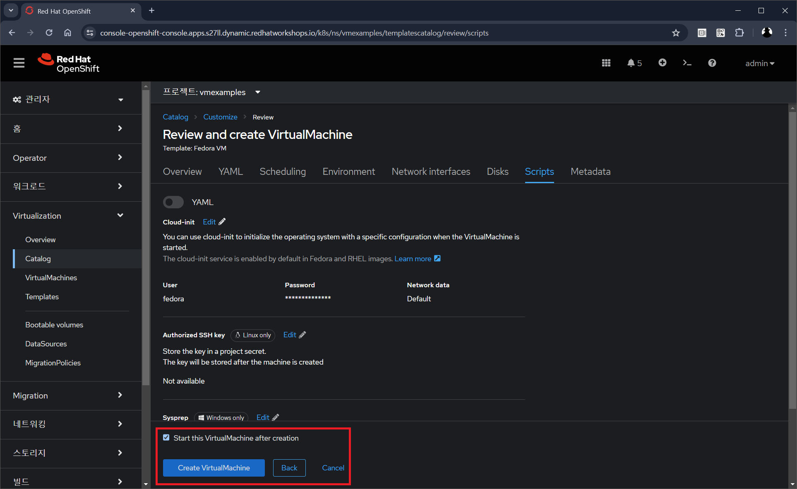</img>  

> [!NOTE]
> *Start this VirtualMachine after creation* 상자를 선택하는 것을 잊은 경우 가상머신이 생성되고 `Stopped` 상태라면 패널 오른쪽 상단에 있는 작업 드롭다운을 클릭하고 **Start** 을 선택합니다.
 

17. 가상머신이 실행되면 **Overview**를 확인합니다.

    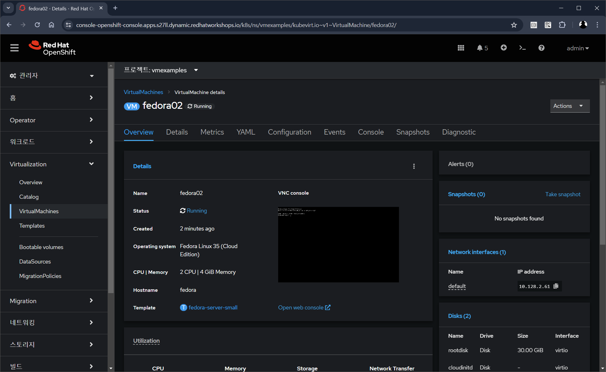</img>  
    * **Name**이 `fedora02`인 것을 확인
    * **CPU|Memory**가 `2CPU|4Gib Memory`인 것을 확인
 

18. **Console** 탭을 사용하여 자유롭게 연결하세요. 사용자는 `fedora`이고 비밀번호는 이전에 지정한 비밀번호입니다(예: `ocpVirtIsGre@t`).

    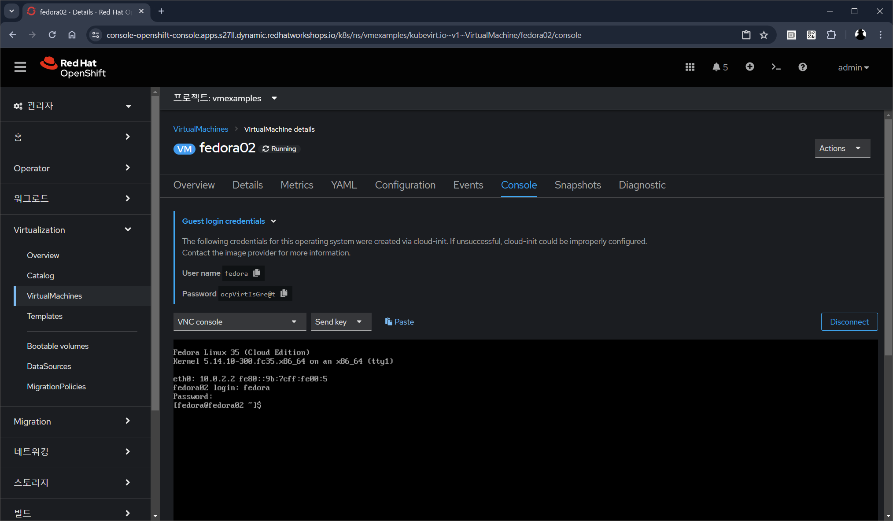</img>  
 
 

## 3. 요약

이 실습에서는 URL에서 호스팅되는 QCOW2 이미지에서 새 가상머신을 만들고 사용자 지정했습니다. 또한 사용자 `fedora`에 대한 사용자 정의 비밀번호를 지정하고 다른 사용자 정의 옵션도 살펴보았습니다.

다음 실습인 가상머신 관리 실습으로 계속 진행할 수 있습니다.
 
 

------
[차례](../README.md) &nbsp;&nbsp;&nbsp;&nbsp; [<< 오픈시프트 가상화 기본 <<](./openshift_virt_basic.md) &nbsp;&nbsp;&nbsp;&nbsp; [>> 가상머신 관리 >>](./vm_management.md)