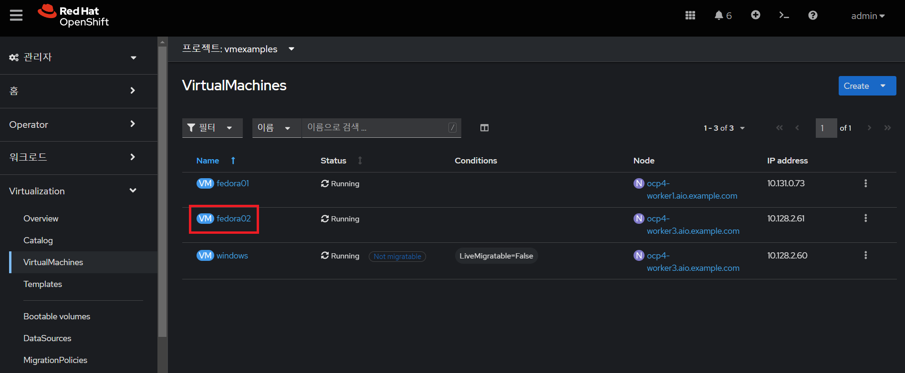
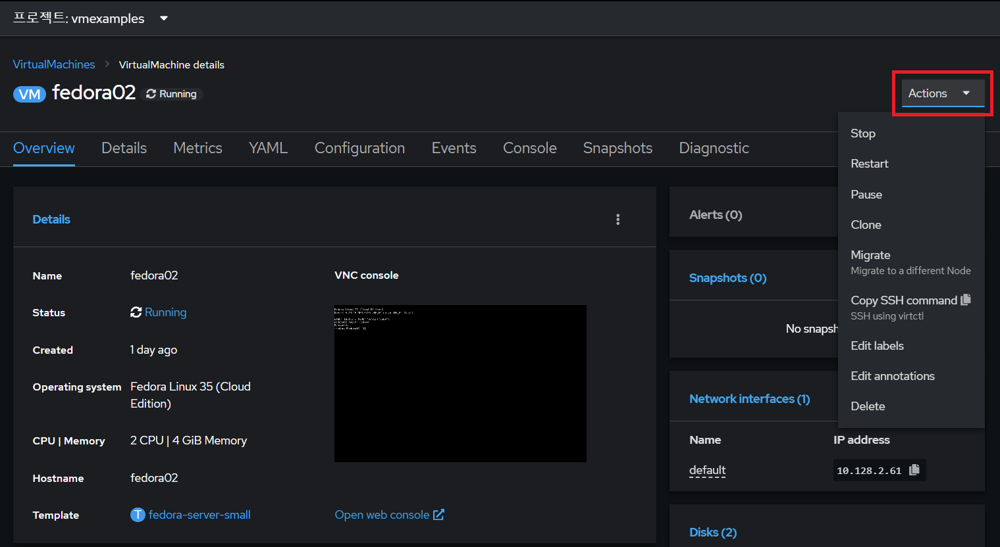
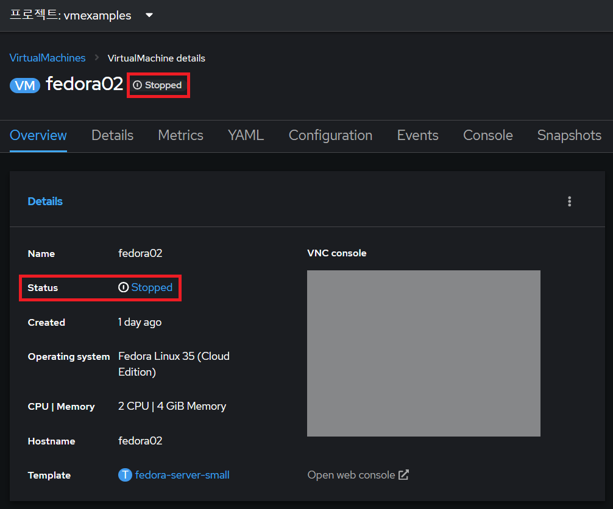
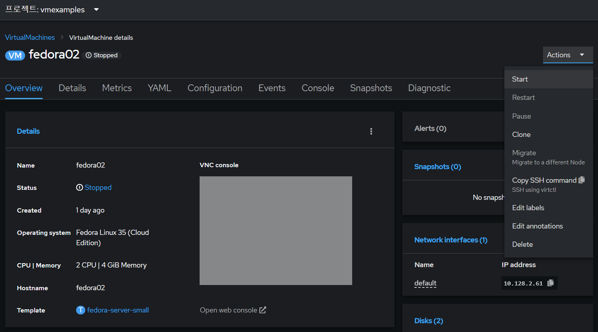
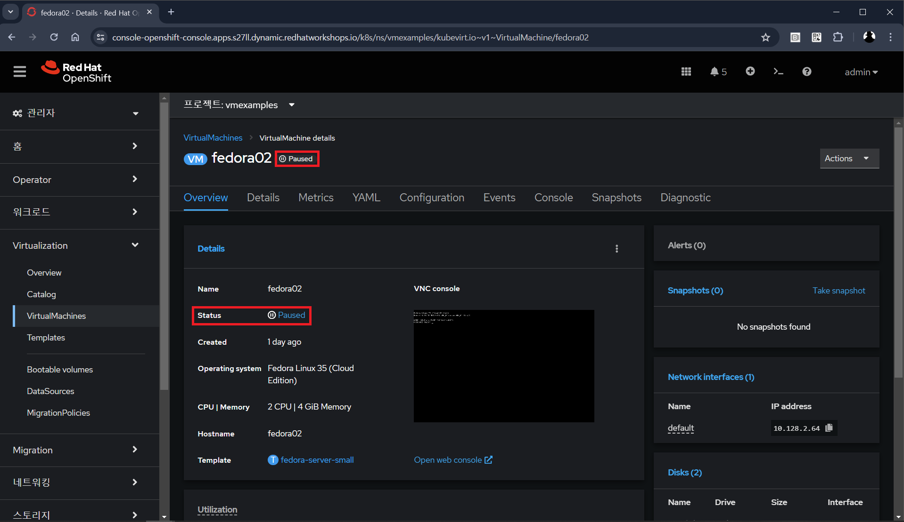
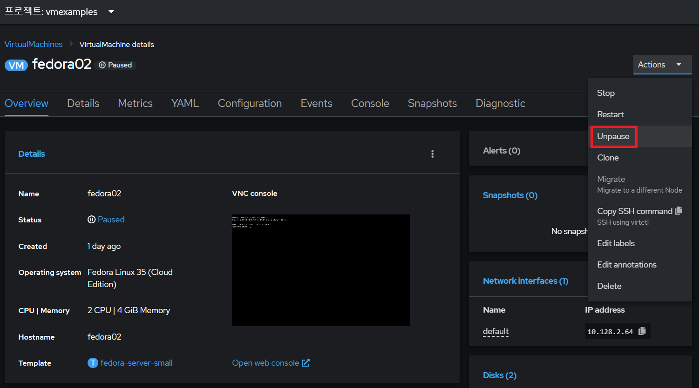
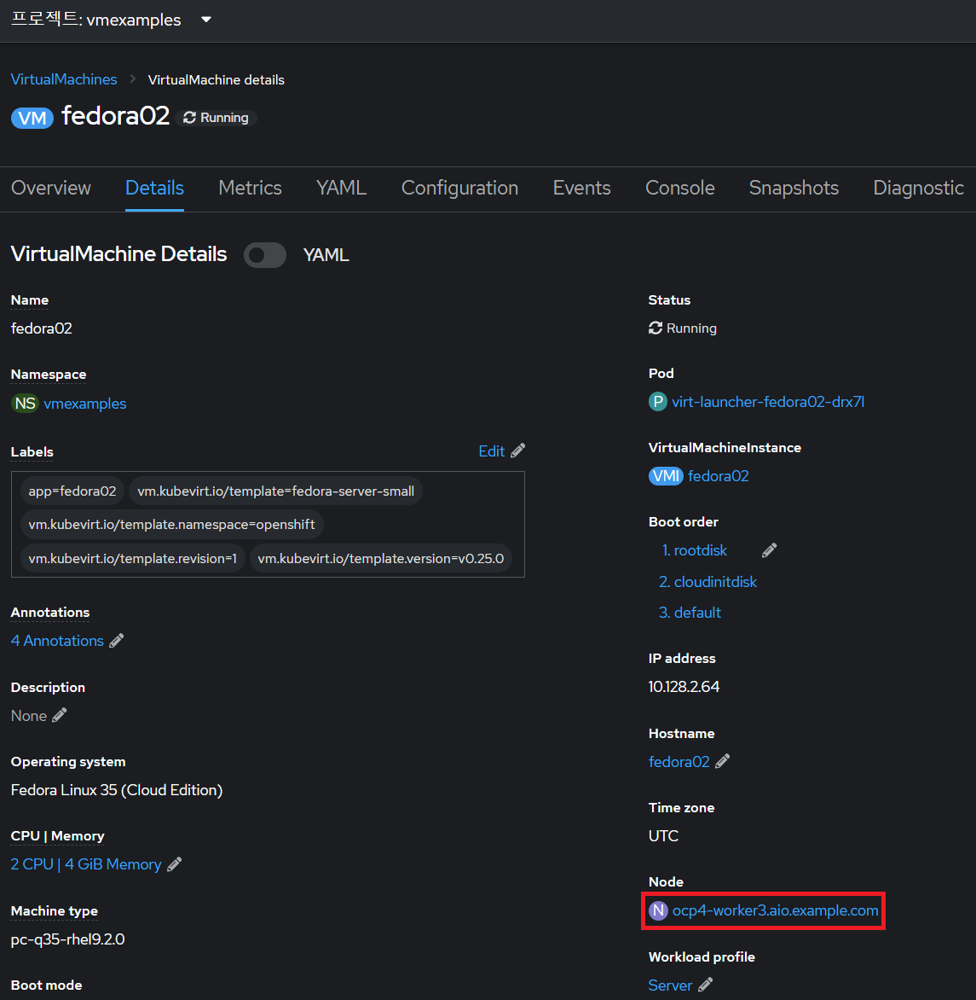
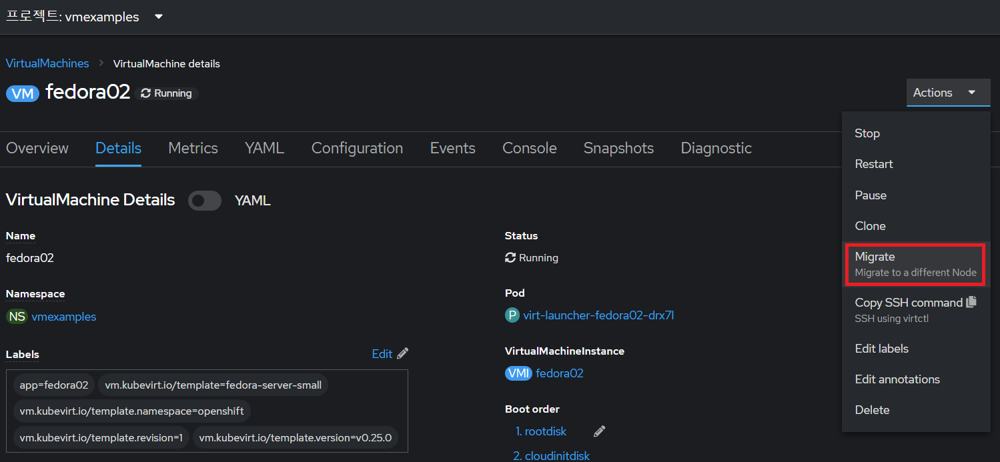
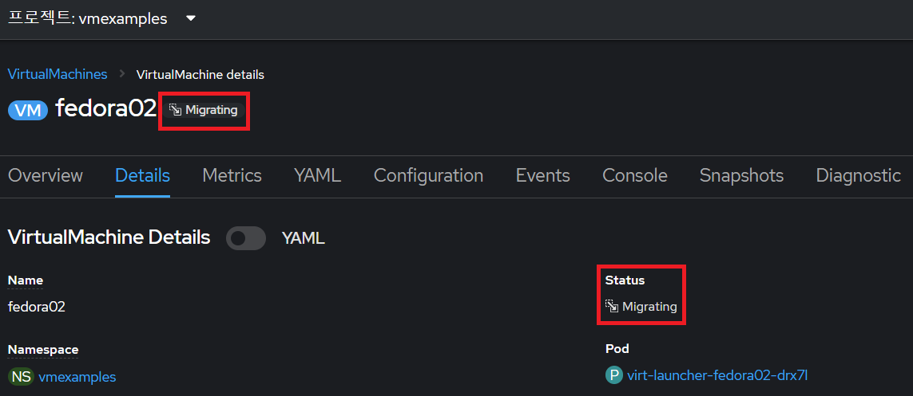
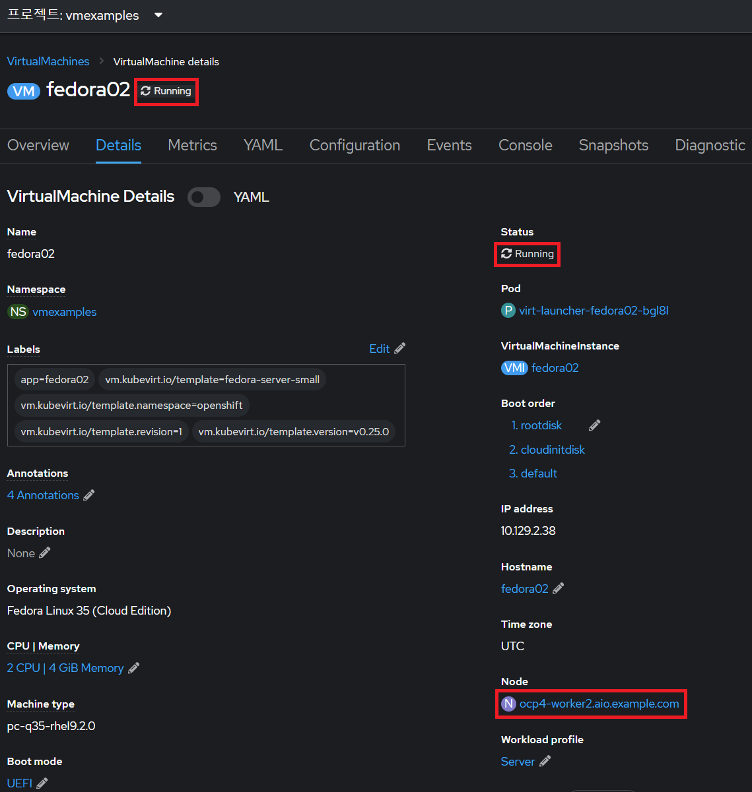

# 가상머신 관리

목차
1. [소개](./vm_management.md#1-소개) 
2. [가상머신 관리](./vm_management.md#2-가상머신-관리) 
   2.1 [가상머신 제어](./vm_management.md#21-가상머신-제어) 
   2.2 [가상머신 라이브 마이그레이션](./vm_management.md#22-가상머신-라이브-마이그레이션) 
3. [요약](./vm_management.md#3-요약)
 
 

## 1. 소개

가상머신을 관리하고 사용하는 것은 단순히 구성을 생성하고 사용자 정의하는 것 이상입니다. 플랫폼 관리자로서 우리는 가상머신 상태를 제어하고 실시간 마이그레이션을 트리거하여 리소스 균형을 맞추고, 유지 관리 작업을 수행하고, 노드를 재구성할 수 있어야 합니다.

 

**목표**
* 오픈시프트 콘솔을 사용하여 가상머신 전원 상태를 관리하는 방법 이해
* 가상머신 실시간 마이그레이션
 
 

## 2. 가상머신 관리

### 2.1 가상머신 제어

가상머신에 액세스할 수 있는 권한이 있는 사용자는 웹 콘솔에서 가상머신을 중지(Stop), 시작(Start), 다시 시작(Restart), 일시 중지(Pause) 및 일시 중지 해제(Unpause)할 수 있습니다.

 

1. 왼쪽 메뉴에서 **Virtualization** → **VirtualMachines**로 돌아갑니다.

 

2. 목록에서 *가상머신* `fedora02`를 선택합니다.

   </img>  
 

3. 오른쪽 상단 드롭다운인 **Actions**을 눌러 사용 가능한 옵션을 나열합니다.

   </img>   

   1. **Stop**: *가상머신*의 정상적인 종료를 시작합니다.

   2. **Restart**: *가상머신*을 재부팅하라는 신호를 운영체제에 보냅니다. 이것이 제대로 작동하려면 게스트 통합이 필요합니다.

   3. **Pause**: CPU 리소스 및 I/O에 대한 추가 액세스 없이 프로세스가 정지되지만 하이퍼바이저 수준에서 *가상머신*이 사용하는 메모리는 할당된 상태로 유지됩니다.
 

4. **Stop**을 누르고 *가상머신*이 `Stopped` 상태가 될 때까지 기다립니다.

   </img>  
 

5. **Actions**을 클릭하면 **Start** 옵션이 나타나고 **Restart** 및 **Pause** 옵션이 회색으로 표시됩니다.

   </img>  
 

6. **Start**을 누르고 `Running` 상태가 될 때까지 기다린 후 **Actions** 메뉴를 사용하여 **Pause** 옵션을 누릅니다.

   </img>  
 

7. *가상머신* 상태가 `Paused`으로 변경됩니다.

   </img>  
 

8. **Actions** 메뉴에서 **Unpause** 클릭하여 *가상머신*의 일시 중지를 해제합니다.

   </img>  
 

### 2.2 가상머신 라이브 마이그레이션

이 섹션에서는 가상머신을 종료하지 않고 가상머신을 하나의 오픈시프트 노드에서 다른 노드로 마이그레이션합니다. 실시간 마이그레이션을 위한 가상머신 디스크는 소스 노드와 대상 노드 모두에 동시에 탑재될 수 있도록 `ReadWriteMany`(RWX) 스토리지이어야 합니다. 오픈시프트 가상화는 다른 가상화 솔루션과 달리 다양한 가상머신에 대한 많은 가상머신 디스크를 보유하는 각 클러스터 구성원에 마운트된 모놀리식 데이터 저장소를 사용하지 않습니다. 대신, 각 가상머신 디스크는 필요할 때만 마운트되는 자체 볼륨에 저장됩니다.

 

1. **Details** 탭으로 이동하여 워커 노드가 실행 중인 위치를 확인합니다.

   </img>  
 

2. **Actions** 메뉴를 사용하여 **Migrate**를 누릅니다.

   </img>  
 

3. 몇 초 후에 가상머신의 상태가 `Migrating`으로 변경됩니다. 

   </img>  
 

4. 몇 초 후에 `Running` 상태로 돌아가지만 다른 노드에 있습니다. 가상머신이 성공적으로 라이브 마이그레이션되었습니다!

   </img>  
 
 

## 3. 요약

이 실습에서는 가상머신 상태 관리 작업을 살펴보고 해당 가상머신의 실시간 마이그레이션을 실행했습니다. 이 두 가지 모두 플랫폼 관리자로서 공통적이고 필요한 작업입니다.
 
 

------
[차례](../README.md) &nbsp;&nbsp;&nbsp;&nbsp; [<< 오픈시프트 가상화 커스터마이징 <<](./openshift_virt_customization.md) &nbsp;&nbsp;&nbsp;&nbsp; [>> 네트워크 관리 >>](./network_management.md)