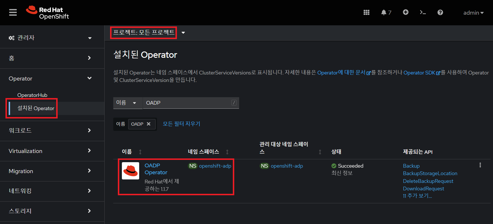
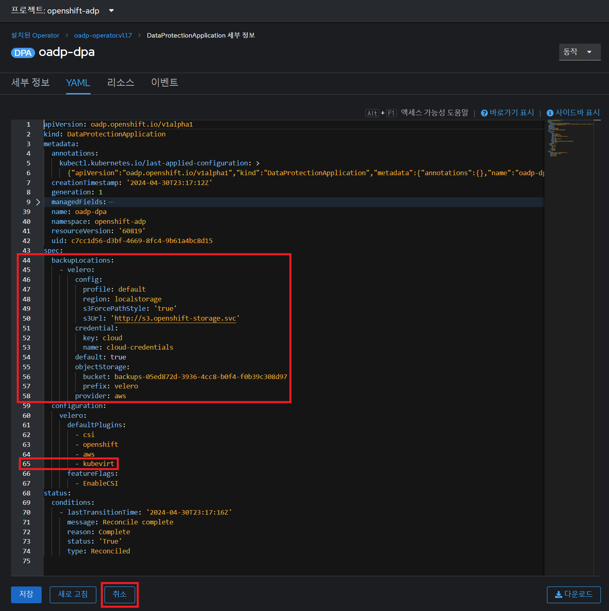
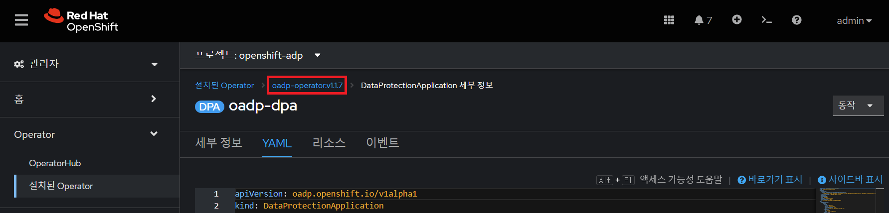
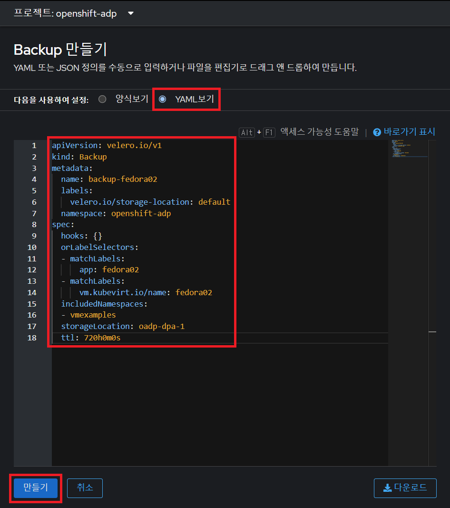
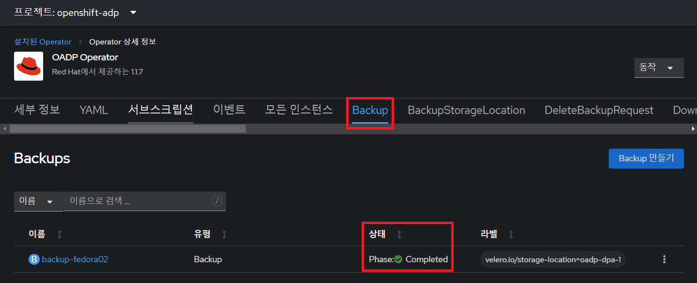
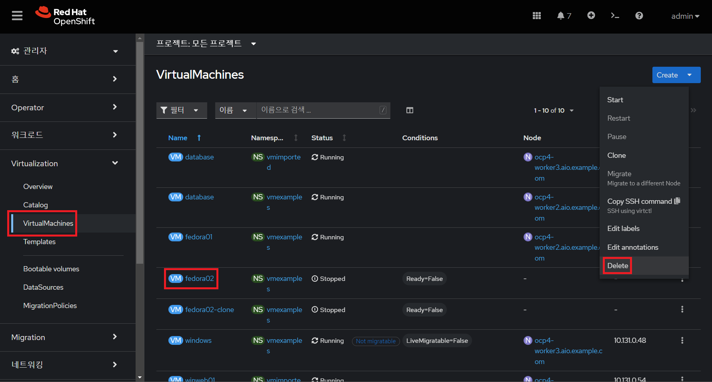
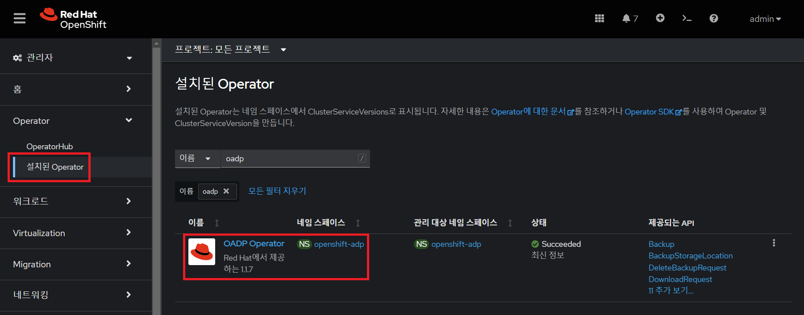
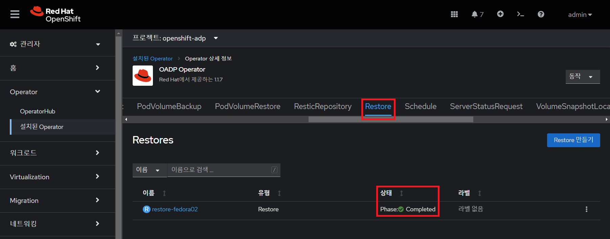
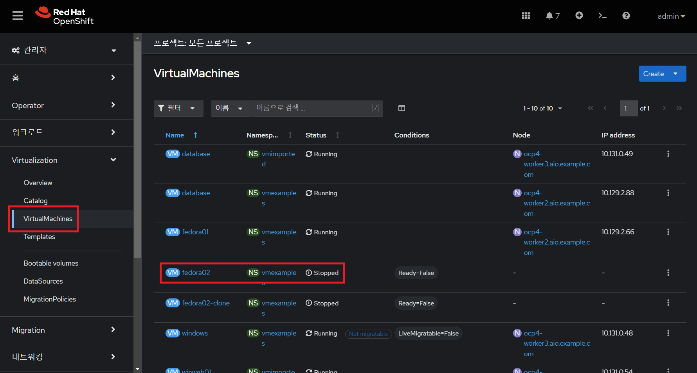

# 백업 및 복구

목차
1. [백업 및 복구 소개](./backup_and_restore.md#1-백업-및-복구-소개)<br>
2. [오퍼레이터 리뷰](./backup_and_restore.md#2-오퍼레이터-리뷰)<br>
3. [백업 생성](./backup_and_restore.md#3-백업-생성)<br>
4. [백업으로 복구](./backup_and_restore.md#4-백업으로-복구)<br>
5. [요약](./backup_and_restore.md#5-요약)<br>
<br>

## 1. 백업 및 복구 소개

오픈시프트 가상화를 사용하는 가상머신의 백업 및 복원에는 여러 가지 옵션이 있습니다.

* **OADP(OpenShift APIs for Data Protection)**: 사용자가 오픈시프트 클러스터의 백업 및 복원 API에 더 쉽게 액세스할 수 있도록 레드햇이 만든 오퍼레이터입니다.
* Veeam의 Kasten K10
* [쿠버네티스 용 Trilio](https://docs.trilio.io/kubernetes/appendix/backup-and-restore-virtual-machine-running-on-openshift-virtualization)
* [소프트웨어 백업 및 복구](https://storware.eu/solutions/containers-backup-and-recovery/red-hat-openshift-backup-restore/)

또한 많은 스토리지 파트너는 자체 기술을 사용하여 가상머신 디스크를 보호하는 기능을 제공합니다. 오픈시프트 가상화와의 호환성을 확인하려면 스토리지 및 백업 공급업체에 문의하세요.

이 실습에서는 OADP 운영자의 구성을 검토하고 가상머신의 백업을 수행한 후 복원합니다.
<br>

**목표**
* 오퍼레이터 리뷰
* 백업 수행
* 복원 수행
<br>
<br>

## 2. 오퍼레이터 리뷰

1. 왼쪽 메뉴에서 **Operators** → **설치된 Operator**로 이동하여 `모든 프로젝트(All projects)`가 선택되었는지 확인합니다. 

   `OADP Operator(오퍼레이터)`를 선택합니다.
   </img> <br> 
<br>

2. 사용 가능한 **제공되는 API**를 검토합니다.

   이 모듈에서는 `백업(Backup)` 및 `복원(Restore)` 기능을 사용합니다.
   </img> <br> 
<br>

3. **DataProtectionApplication** 탭으로 이동합니다. 이 객체는 배포된 OADP 인스턴스의 구성을 나타냅니다.

   </img> <br> 
<br>

4. `oadp-dpa`를 선택하고 **YAML** 탭을 선택하여 내용을 검토합니다.

   </img> <br> 

   `kubevirt` 플러그인을 추가하여 **OADP**가 구성되었으며 **레드햇 스토리지**에서 제공하는 내부 오브젝트 스토리지 버킷을 사용하도록 구성되었습니다.

   프로덕션 환경에서는 외부 스토리지 시스템에 백업하고 싶지만, 본 실습에서는 편의상 내부 오브젝트 스토리지를 사용합니다.
   
   **취소**를 누릅니다.
<br>
<br>

## 3. 백업 생성

가상머신 `fedora02`의 백업을 수행합니다. 백업할 객체의 선택은 `app` 및 `vm.kubevirt.io/name` 레이블에 의해 정의됩니다. 여기에는 구성 맵 및 비밀과 같이 가상머신에서 사용되는 가상머신 정의, 디스크 및 추가 개체가 포함됩니다.

1. 오퍼레이터 이름을 클릭하여 한 화면으로 돌아가 기본 오퍼레이터 페이지로 이동합니다.

   </img> <br>
<br>

2. **Backup** 탭으로 이동하여 **Backup 만들기**를 누릅니다.

   </img> <br> 
<br>

3. **Backup 만들기** 폼을 확인하고 *YAML 보기*로 전환 합니다.

   </img> <br> 
   

   콘텐츠를 다음 항목으로 바꿉니다.
   ```yaml
   apiVersion: velero.io/v1
   kind: Backup
   metadata:
     name: backup-fedora02
     labels:
       velero.io/storage-location: default
     namespace: openshift-adp
   spec:
     hooks: {}
     orLabelSelectors:
     - matchLabels:
         app: fedora02
     - matchLabels:
         vm.kubevirt.io/name: fedora02
     includedNamespaces:
     - vmexamples
     storageLocation: oadp-dpa-1
     ttl: 720h0m0s
   ```

   이 YAML의 콘텐츠는 `vmexamples` 네임스페이스에 `app: fedora02` 레이블이 있는 모든 객체가 `DataProtectionApplication` 구성에 지정된 위치에 백업된다는 것을 나타냅니다.

   </img> <br> 

   **만들기**를 누릅니다.
<br>

4. `상태` 열을 통해 진행 사항을 확인합니다.

   `Phase: InProgress`로 백업 진행 중입니다.
   </img> <br> 

   `Phase: Completed`으로 바뀔 때까지 기다립니다. 이는 가상머신이 성공적으로 백업되었음을 나타냅니다.
   </img> <br> 
<br>
<br>

## 4. 백업으로 복구

1. **Virtualization** → **VirtualMachines**로 이동하여 `fedora02` 가상머신을 삭제합니다.

   </img> <br>
<br>

2. **Operators** → **설치된 Operator**로 돌아가서 **OADP Operator**를 선택합니다.

   </img> <br> 
<br>

3. **Restore** 탭으로 전환하고 **Restore 만들기**를 누릅니다.

   </img> <br> 
<br>

4. YAML 보기로 전환하고 콘텐츠를 다음 항목으로 바꿉니다.

   ```yaml
   apiVersion: velero.io/v1
   kind: Restore
   metadata:
     name: restore-fedora02
     namespace: openshift-adp
   spec:
     backupName: backup-fedora02
     includedResources: []
     excludedResources:
     - nodes
     - events
     - events.events.k8s.io
     - backups.velero.io
     - restores.velero.io
     restorePVs: true
   ```

   </img> <br>
   변경된 YAML을 확인하고 **만들기**를 누릅니다. 
<br>

5. `상태` 열을 통해 진행을 확인합니다.

   `Phase: InProgress`는 현재 진행 중인 것을 나타냅니다.
   </img> <br> 
   
   `Phase: Completed`으로 바뀔 때까지 기다립니다.
   </img> <br> 
<br>

6. **Virtualization** → **Virtual Machines**으로 다시 이동하여 `fedora02`가 복원되었는지 확인합니다.

   </img> <br> 
<br>
<br>

## 5. 요약

가상머신을 보호하는 것은 가상화 플랫폼의 중요한 측면입니다. 오픈시프트 가상화는 OADP를 사용하거나 스토리지 및 백업 파트너가 제품을 통합하도록 허용하는 등 기본 보호를 활성화하는 다양한 방법을 제공합니다. 

가상머신을 보호하는 방법에 대해 궁금한 점이 있으면 주저하지 말고 담당자에게 워크숍을 요청하거나 공급업체에 문의하여 오픈시프트 가상화와의 호환성을 확인하세요.
<br>
<br>

------
[차례](../README.md) &nbsp;&nbsp;&nbsp;&nbsp; [<< 가상머신 로드밸런싱 <<](./vm_load_balancing.md) &nbsp;&nbsp;&nbsp;&nbsp; [>> 오픈시프트 가상화 마무리 >>](./close.md)