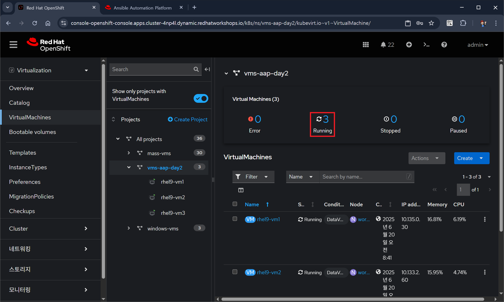

# 기본적인 Day-2 운영

**목차**

1. [동적 인벤토리 생성](basic_day_2_day_ops.md#1-동적-인벤토리-생성)<br>
   1.1 [목적](basic_day_2_day_ops.md#11-목적)<br>
   1.2 [인벤토리 생성](basic_day_2_day_ops.md#12-인벤토리-생성)<br>
   1.3 [인벤토리에 소스 추가](basic_day_2_day_ops.md#13-인벤토리에-소스-추가)<br>
   1.4 [인벤토리 업데이트](basic_day_2_day_ops.md#14-인벤토리-업데이트)<br>
   1.5 [오픈시프트 콘솔에서 검증](basic_day_2_day_ops.md#15-오픈시프트-콘솔에서-검즘)<br>

2. [보안 및 컴플라이언스](basic_day_2_day_ops.md#2-보안-및-컴플라이언)<br>
   2.1 [목적](basic_day_2_day_ops.md#21-목적)<br>
   2.2 [ScanSetting 생성 및 스캐닝 프로파일 확인](basic_day_2_day_ops.md#22-scansetting-생성-및-스캐닝-프로파일-확인)<br>
   2.3 [ScanSettingBinding을 생성하여 프로파일 스캔 실행](basic_day_2_day_ops.md#23-scansettingbinding을-생성하여-프로파일-스캔-실행)<br>

3. [네트워크 정책 구성](basic_day_2_day_ops.md#3-네트워크-정책-구성)<br>
   3.1 [목표](basic_day_2_day_ops.md#31-목표)<br>
   3.2 [가상머신의 Egress 네트워크 확인](basic_day_2_day_ops.md#32-가상머신의-egress-네트워크-확인)<br>
   3.3 [가상머신에 레이블 추가](basic_day_2_day_ops.md#33-가상머신에-레이블-추가)<br>
   3.4 [네트워크 정책 생성](basic_day_2_day_ops.md#34-네트워크-정책-생성)<br>
   3.5 [가상머신 상에 네트워크 정책 효과 확인](basic_day_2_day_ops.md#35-가상머신-상에-네트워크-정책-효과-확인)<br>
   3.6 [네트워크 정책 지우기](basic_day_2_day_ops.md#36-네트워크-정책-지우기)<br>

4. [모니터링과 알럿](basic_day_2_day_ops.md#4-모니터링과-알럿)<br>
   4.1 [노드 알럿과 그래프](basic_day_2_day_ops.md#41-노드-알럿과-그래프)<br>
   4.2 [가상머신 그래프](basic_day_2_day_ops.md#42-가상머신-그래프)<br>
   4.3 [대시보드 검사](basic_day_2_day_ops.md#43-대시보드-검사)<br>
   
5. [가상머신 관리 자동화](basic_day_2_day_ops.md#5-가상머신-관리-자동화)<br>
   5.1 [가상머신 중지/시작/재시작](basic_day_2_day_ops.md#51-가상머신-중지시작재시작)<br>
   5.2 [가상머신 패치 작업](basic_day_2_day_ops.md#52-가상머신-패치-작업)<br>
   5.3 [메모리 리소스 핫 플러그인](basic_day_2_day_ops.md#53-cpu--메모리-리소스-핫-플러그인)<br>
<br>
<br>

## 1. 동적 인벤토리 생성

### 1.1 목적

* 동적 인벤토리를 사용
  + AAP가 외부 소스에서 시스템 인벤토리를 자동으로 가져오고 업데이트
  + 수동 인벤토리 관리가 필요 없음
* 실습에서는 오픈시프트 가상화에서 데이터를 가져오는 동적 인벤토리를 구성
  + AAP는 오픈시프트 클러스터의 vms-aap-day2 네임스페이스에 있는 가상머신을 관리
<br>

### 1.2 인벤토리 생성

#### 1.2.1 **Automation Execution** → **Ifrastructure** → **인벤토리** 클릭

#### 1.2.2 **인벤토리** 페이지에서 **인벤토리 생성**을 클릭하여 **인벤토리 생성** 선택


#### 1.2.3 **인벤토리 > 인벤토리** 생성 페이지에서 **이름** 입력 및 **조직** 선택


* 이름: `오픈시프트 가상머신`
* 조직: `Default`

#### 1.2.4 하단의 **인벤토리 생성** 버튼을 클릭 후 생성된 인벤토리 확인


<br>

### 1.3 인벤토리에 소스 추가

#### 1.3.1 **소스** 탭을 선택 후, **Create source**를 클릭


#### 1.3.2 **Create source** 페이지에서 기본 및 상세 정보 입력


* 기본 정보
  + 이름: `오픈시프트 가상머신 소스`
  + 실행 환경: `Day 2 EE`
  + 소스: `OpenShift Virtualization`
* 상세 정보
  + 인증 정보: `OpenShift Credential`

#### 1.3.3 **Create source** 페이지에서 옵션 설정


* 옵션
  + Update on launch: 체크
* Option Details
  + Cache timeout (seconds): `0`
  + Source variables:
    ```yaml
    namespaces:
      - vms-aap-day2
    ```

#### 1.3.4 **Create source**를 클릭 후 인벤토리 소스의 세부 정보 확인


<br>

### 1.4 인벤토리 업데이트

#### 1.4.1 *오픈시프트 가상머신 소스*의 **세부 정보** 페이지에서 **Launch inventory update**를 클릭


* **마지막 작업 상태**가 `실행 중`에서 `성공`으로 끝날 때까지 기다림

#### 1.4.2 **Back to Inventory Sources** 탭을 클릭 후, **호스트** 탭을 클릭


* 가상머신 리스트
  + vms-aap-day-rhel9-vm1
  + vms-aap-day-rhel9-vm2
  + vms-aap-day-rhel9-vm3
* Related groups: namespace_vms_aap_day2
  + 네임스페이스 `vms_aap_day2`에서 온 것임을 확인

#### 1.4.3 모든 가상머신을 선택 후, **Run command**를 클릭


#### 1.4.4 **세부 정보** 섹션에서 모듈 선택, **Next** 클릭


* Module: `ping`

#### 1.4.5 **실행 환경** 섹션에서 실행 환경 선택, **Next** 클릭


* 실행 환경: `Day 2 EE`

#### 1.4.6 **인증 정보** 섹션에서 인증 정보 선택후, **Next** 클릭


* 인증 정보: `Workshop Credential`

#### 1.4.7 **Review** 섹션에서 설정 값 확인 후 **Finish** 클릭


#### 1.4.8 작업의 실행 결과 확인


* ping 모듈이 성공적으로 끝난 것을 확인
<br>

### 1.5 오픈시프트 콘솔에서 검즘

#### 1.5.1 오픈시프트 콘솔에서 모드를 *Virtualization*으로 변경

#### 1.5.2 **VirtualMachines**의 프로젝트 트리에서 *vms-aap-day2*를 선택


* 3개의 가상머신이 실행 중인 것을 확인: rhel9-vm1 / rhel9-vm2 / rhel9-vm3

<br>
<br>

## 2. 보안 및 컴플라이언

### 2.1 목적

* 오픈시프트 클러스터에서 보안 검사를 구성하기 위해 오픈시프트 컴플라이언스 오퍼레이터 활용
* 컴플라이언스 오퍼레이터는 오픈시프트 환경의 호스트가 특정 보안 기준을 충족하고 해당 기준에 맞게 배포되도록 보장
<br>

### 2.2 ScanSetting 생성 및 스캐닝 프로파일 확인

#### 2.2.1 오픈시프트 콘솔의 모드를 *관리자*로 변경

#### 2.2.2 **Operator** → **설치된 Operator**에서 프로젝트는 *모든 프로젝트* 선택 후, *Compliance Operator* 클릭


#### 2.2.3 **ScanSetting** 탭을 선택 후, **ScanSetting 만들기** 클릭


#### 2.2.4 이름 입력 후 **YAML보기** 클릭


#### 2.2.5 YAML 콘텐츠 확인 후 **만들기** 클릭


* ScanSetting의 설정 YAML
  ```yaml
  apiVersion: compliance.openshift.io/v1alpha1
  autoApplyRemediations: false
  debug: true
  rawResultStorage:
    rotation: 10
    size: 2Gi
  roles:
    - worker
    - master
  schedule: 0 1 * * *
  kind: ScanSetting
  metadata:
    name: scan01
    namespace: openshift-compliance
  ```
  + *autoApplyRemediations*: `false`
  + *roles[]*: `master`, `worker`
  + *metadata.name*: `scan01`

#### 2.2.6 생성된 ScanSettings 확인 후, **Profile** 탭에서 `rhcos4-moderate`를 찾아 클릭


* **Profile** 탭에는 사전 정의된 많은 스캐닝 프로파일을 확인할 수 있음
* rhcos4-moderate* 프로파일은 FedRamp-moderate 프로파일 임

#### 2.2.7 YAML 탭을 클릭하여, *rules*를 확인


* RHCOS4를 위한 많을 룰(rule)이 있는 것을 확인
<br>

### 2.3 ScanSettingBinding을 생성하여 프로파일 스캔 실행

#### 2.3.1 컴플라이언스 오퍼레이터의 **Scan Setting Binding** 탭을 선택 후, **ScanSettingBinding 만들기** 클릭


#### 2.3.2 **YAML보기**에서 설정 변경 후, **만들기** 클릭


* 설정 YAML
  ```yaml
  kind: ScanSettingBinding
  apiVersion: compliance.openshift.io/v1alpha1
  metadata:
    name: fedramp01
    namespace: openshift-compliance
  profiles:
    - apiGroup: compliance.openshift.io/v1alpha1
      kind: Profile
      name: rhcos4-moderate
  settingsRef:
    apiGroup: compliance.openshift.io/v1alpha1
    kind: ScanSetting
    name: scan01
  ```
  + *metadata.name*: `fedramp01`
  + *settingsRef.name*: `scan01`

#### 2.3.3 생성된 ScanSettingBinding 확인


#### 2.3.4 **Compliance Suite** 탭을 클릭하여 자동으로 실행된 것을 확인


* ScanSettingBinding이 생성되면, *fedramp01* 스캔이 자동으로 실행됨
  + Compliance Suite은 *scan01*에서 지정한 master, worker를 대상으로 정의된 스캔을 실행함

#### 2.3.5 **Compliance Scan** 탭을 클릭하여 스캔 진행 상태 확인


* **상태** 필드의 값으로 확인
  + RUNNING / AGGREGATING / DONE

#### 2.3.6 **ComplianceCheckResult** 탭을 클릭하여 스캔 결과를 확인


#### 2.3.7 검색 바를 *레이블*로 변경 후, 레이블을 추가하여 확인


* 레이블
  + `compliance.openshift.io/check-status=FAIL`
  + `compliance.openshift.io/check-severity=high`
* 여러 개의 *high severity* 체크가 실패한 것을 확인
<br>
<br>

## 3. 네트워크 정책 구성

### 3.1 목표

* 오픈시프트 관리자는 네트워크 정책을 구성하여 환경과 해당 환경에서 실행되는 가상 게스트의 보안을 강화 가능
* 실습에서는 가상 머신을 구성한 후, 외부로의 유출을 방지하는 네트워크 정책을 적용
* 네트워크 정책은 매우 다양한 기능을 갖추고 있으며 조정 가능성도 매우 높음
  + 마이크로세그먼테이션 정책을 구현 다음과 환경에 있는 가상 게스트 간의 트래픽 흐름을 제어 가능
    - 클러스터 내부 및 외부
    - 서로 다른 오픈시프트 프로젝트
    - 동일한 오픈시프트 프로젝트
<br>

### 3.2 가상머신의 Egress 네트워크 확인

#### 3.2.1 오픈시프트 콘솔의 모드를 *Virtualization*로 변경

#### 3.2.2 **VirtualMachines**의 프로젝트 트리에서 *vms-aap-day2*에 속한 가상머신 *rhel9-vm1* 클릭


#### 3.2.3 **Console**을 클릭 후, 사용자 이름과 암호를 이용하여 콘솔에 로그인


#### 3.2.4 외부를 ping을 하여 외부로 패킷이 나가는 것을 확인


* 가상머신 콘솔에서 다음을 실행
  ```bash
  ping www.google.com
  ```
* 통신이 되는 것을 확인하며, Ctrl+C로 중단
<br>

### 3.3 가상머신에 레이블 추가

#### 3.3.1 오픈시프트 콘솔의 모드를 *관리자*로 변경

#### 3.3.2 **워크로드** → **Pod**에서 프로젝트를 *vms-aap-day2*로 변경


* 가상머신을 위한 *virt-launcher-\** 포드 확인 가능

#### 3.3.3 포드 *virt-launcher-rhel9-vm1-\**을 클릭 후, **세부 정보** 탭에서 라벨 편집


#### 3.3.4 레이블 `app=network-policy-deny`를 추가 후 **저장** 클릭


#### 3.3.5 추가된 레이블 확인 후, 가상머신 *rhel9-vm2*의 *virt-launcher-rhel9-vm2-\**에도 같은 작업 반복

<br>

### 3.4 네트워크 정책 생성

#### 3.4.1 **네트워킹** → **NetworkPolicies**에서 프로젝트를 *vms-aap-day2*로 변경 후, **Create NetworkPolicy** 클릭


#### 3.4.2 정책 설정 값 입력


* 정책 이름: `ping-egress-deny`
* Pod 선태기
  + 레이블: `app`
  + 선택기: `network-policy-deny`
* 정책 유형
  + 모든 Egress 트래픽 거부: 체크

#### 3.4.3 영향을 받는 포드 확인 후, 나머지는 그대로 두고 **만들기** 클릭


* 다음 포드가 영향을 받음
  + *virt-lanucher-rhel9-vm1-\**
  + *virt-launcher-rhel9-vm2-\**

#### 3.4.4 생성된 네트워크 정책 확인

<br>

### 3.5 가상머신 상에 네트워크 정책 효과 확인

#### 3.5.1 *VirtualMachines**의 프로젝트 트리에서 *vms-aap-day2*에 속한 가상머신 *rhel9-vm1* 클릭

#### 3.5.2 **Console** 탭에서 외부로 ping 테스트


* DNS 조회를 포함하여, 모든 Egress가 블록된 것을 확인
<br>

### 3.6 네트워크 정책 지우기

#### 3.6.1 **네트워킹** → **NetworkPolicies**에서 프로젝트를 *vms-aap-day2*로 변경

#### 3.6.2 네트워크 정책 *ping-egress-deny* 삭제


<br>
<br>

## 4. 모니터링과 알럿

### 4.1 노드 알럿과 그래프

#### 4.1.1 **컴퓨팅** → **노드** 클릭


* 항목
  + 클러스터의 각 노드 및 상태
  + 노드의 역할
  + 현재 호스팅하고 있는 포드 수
  + 메모리 및 CPU 사용률과 같은 물리적 속성

#### 4.1.2 워커노드-4를 클릭하여 노드 정보 확인


* 노드 세부 정보 페이지가 나타나 노드에 대한 자세한 정보를 확인
* 화면 상단 중앙에는 노드에서 생성되는 알림이 표시
* 화면 하단 중앙에는 CPU, 메모리, 스토리지, 네트워크 처리량 그래프가 표시되어 노드 사용률을 시각화하는 데 도움이 되는 그래프가 제공
  + 사용률 패널 오른쪽 상단의 드롭다운을 클릭하여 그래프 검토 기간을 1시간, 6시간 또는 24시간으로 변경 가능
<br>

### 4.2 가상머신 그래프

#### 4.2.1 오픈시프트 *관리자* 모드에서, **워크로드** → **배포** 클릭 후, 프로젝트를 *vms-aap-day2*로 변경


* 포드 *loadmaker* 하나가 배포되어 있는 것을 확인

#### 4.2.2 포드 *loadmaker*를 클릭하여 세부 정보 확인


#### 4.2.3 **환경** 탭을 클릭 후, *REQUEST_PER_SECOND*의 값을 `75`로 변경 후 **저장** 클릭


#### 4.2.4 오프시프트 *Virtualization* 모드로 변경 후, **VirtualMachines**에서 프로젝트 *windows-vms* 선택 후, 가상머신 *winweb01* 선택


* 가상머신 *winweb01*이 중지되었으면 시작
* 가상머신 *database*가 실행 중인 것을 확인
* 가상머신 *winweb02*는 중지 상태이어야 함

#### 4.2.5 가상머신 *winweb01*을 클릭하여 **Overview** 하단의 **Utilization** 섹션 확인


* 15초마다 업데이트되는 VM 리소스(CPU, 메모리, 스토리지, 네트워크 전송)의 기본 상태
* 최근 기간의 VM 성능을 자세히 보여주는 여러 개의 작은 그래프가 있음
  + 기본적으로는 최근 5분
  + 드롭다운 메뉴에서 최대 1주일까지의 값을 선택 가능

#### 4.2.6 가상머신의 네트워크 전송 상세 확인


* 가상머신의 네트워크 인터페이스 별로 확인 가능
* 현재 *default* 인터페이스만 있음

#### 4.2.7 CPU 사용률 클릭


#### 4.2.8 CPU 사용률 메트릭 확인


* CPU 사용률 상세 정보를 보여줌
* 최근 30분이 기본 값이며 변경 가능
* 우측 상단의 업데이트 주기가 30초이며, 변경 가능

#### 4.2.9 하단의 쿼리 내용을 확인하고, **쿼리 추가**를 클릭


* 현재 쿼리
```sql
sum(rate(kubevirt_vmi_cpu_usage_seconds_total{name='winweb01',namespace='windows-vms'}[5m])) BY (name, namespace)
```

#### 4.2.10 새로운 쿼리 추가 후, **쿼리 실행**을 클릭


* 새로운 쿼리
```sql
sum(rate(kubevirt_vmi_vcpu_wait_seconds_total{name='winweb01',namespace='windows-vms'}[5m])) BY (name, namespace)
```

#### 4.2.11 쿼리에 의한 그래프가 추가 된 것을 확인


<br>

### 4.3 대시보드 검사

#### 4.3.1 **모니터링** → **대시 보드** 클릭 후, **대시 보드**에서 *KubeVirt/Infrastructure Resources/Top Consumers*를 선택


* 오픈시프트 클러스터의 모든 가상머신 중 Top Consumer를 보여줌

#### 4.3.2 하단으로 스크롤하여 *CPU Usage by virt-launcher Pods*를 확인하고 **검사**를 클릭


#### 4.3.3 개체를 선택하여 표시할 수 있음


* 하단의 각 개체를 선택 혹은 해제하여 표시 가능

<br>
<br>

## 5. 가상머신 관리 자동화

### 5.1 가상머신 중지/시작/재시작

#### 5.1.1 목묘

* AAP를 사용하여 오픈시프트 가상화에서 실행되는 가상머신의 라이프-사이클 관리
* 지정된 네임스페이스의 모든 가상머신을 중지, 시작 및 다시 시작

#### 5.1.2 플레이북 구성

***manage_vm_playbook.yml*** 
```yaml
---
- name: Manage a Virtual Machine
  hosts: localhost
  roles:
    - redhatone.vm_management.vm_management
```
* 입력 변수에 따라 적절한 태스크를 호출하는  플레이북

***vm_management/vars/main.yml***
```yaml
---
# vars file for vm_management
OCP_HOST: "{{ lookup('env', 'K8S_AUTH_HOST') | default('OCP_HOST_NOT_FOUND', true) }}"
OCP_BEARER_TOKEN: "{{ lookup('env', 'K8S_AUTH_API_KEY') | default('OCP_BEARER_NOT_FOUND', true) }}"
```

***vm_management/tasks/main.yml***
```yaml
---
# tasks file for vm_management

- name: Run the specific vm_management task
  include_tasks: "{{ task_file }}"
```
* 동적으로 태스크 포함

***vm_management/tasks/stop_vm.yml***
```yaml
---
- name: Get all VirtualMachines in the namespace
  redhat.openshift_virtualization.kubevirt_vm_info:
    namespace: "{{ vm_namespace }}"
  register: vm_info

- name: Debug the vm_info variable
  ansible.builtin.debug:
    var: vm_info

- name: Stop VM using OpenShift API
  ansible.builtin.uri:
    url: "{{ OCP_HOST }}/apis/subresources.kubevirt.io/v1/namespaces/{{ vm_namespace }}/virtualmachines/{{ item.metadata.name }}/stop"
    method: PUT
    headers:
      Authorization: "Bearer {{ OCP_BEARER_TOKEN }}"
    validate_certs: false
    status_code:
      - 202
  loop: "{{ vm_info.resources }}"
  loop_control:
    label: "{{ item.metadata.name }}"
  changed_when: item.status.printableStatus != "Stopped"
```
* 주어진 네임스페이스 상의 상태가 *Stopped*이 아닌 모든 가상머신을 중지

***vm_management/tasks/start_vm.yml***
```yaml
---
- name: Get all VirtualMachines in the namespace
  redhat.openshift_virtualization.kubevirt_vm_info:
    namespace: "{{ vm_namespace }}"
  register: vm_info

- name: Debug the vm_info variable
  ansible.builtin.debug:
    var: vm_info

- name: Start VM using OpenShift API
  ansible.builtin.uri:
    url: "{{ OCP_HOST }}/apis/subresources.kubevirt.io/v1/namespaces/{{ vm_namespace }}/virtualmachines/{{ item.metadata.name }}/start"
    method: PUT
    headers:
      Authorization: "Bearer {{ OCP_BEARER_TOKEN }}"
    validate_certs: false
    status_code:
      - 202
  loop: "{{ vm_info.resources }}"
  loop_control:
    label: "{{ item.metadata.name }}"
  changed_when: item.status.printableStatus != "Running"
```
* 주어진 네임스페이스 상의 상태가 *Running*이 아닌 모든 가상머신을 시작

***vm_management/tasks/restart_vm.yml***
```yaml
---
- name: Get all VirtualMachines in the namespace
  redhat.openshift_virtualization.kubevirt_vm_info:
    namespace: "{{ vm_namespace }}"
  register: vm_info

- name: Debug the vm_info variable
  ansible.builtin.debug:
    var: vm_info

- name: Restart VM using OpenShift API
  ansible.builtin.uri:
    url: "{{ OCP_HOST }}/apis/subresources.kubevirt.io/v1/namespaces/{{ vm_namespace }}/virtualmachines/{{ item.metadata.name }}/restart"
    method: PUT
    headers:
      Authorization: "Bearer {{ OCP_BEARER_TOKEN }}"
    validate_certs: false
    status_code:
      - 202
  loop: "{{ vm_info.resources }}"
  loop_control:
    label: "{{ item.metadata.name }}"
  changed_when: item.status.printableStatus != "Stopped"
```
* 주어진 네임스페이스 상의 상태가 *Stopped*이 아닌 모든 가상머신을 재시작

#### 5.1.3 오픈시프트 콘솔에서 프로젝트 *vms-aap-day2*의 모든 가상머신이 실행 중인 것을 확인



#### 5.1.4 AAP의 **Automation Execution** → **템플릿**에서 **템플릿 생성** 클릭한 후, *작업 템플릿 생성* 선택


#### 5.1.5 기본값 설정


* 이름: `Stop VMs`
* 작업 유형: `실행`
* 인벤토리: `오픈시프트 가상머신`
* 프로젝트: `Workshop Project`
* Playbook: `solutions/manage_vm_playbook.yml`
* 실행 환경: `Day 2 EE`
* 인증 정보: `OpenShift Credential`

#### 5.1.6 추가 변수 입력 후 **작업 템플릿 생성** 클릭


* Extra variables
  ```yaml
  vm_namespace: vms-aap-day2
  task_file: stop_vm.yml
  ```

#### 5.1.7 생성된 템플릿 확인 후 **템플릿 시작**을 클릭


#### 5.1.8 실행 결과 확인


#### 5.1.9 오픈시프트 콘솔에서 가상 머신이 중지된 것을 확인


#### 5.1.10 AAP 콘솔에서 같은 방식으로 *Start VMs* 템플릿 생성 후 **템플릿 시작**을 클릭하여 테스트

* 이름: `Start VMs`
* 작업 유형: `실행`
* 인벤토리: `오픈시프트 가상머신`
* 프로젝트: `Workshop Project`
* Playbook: `solutions/manage_vm_playbook.yml`
* 실행 환경: `Day 2 EE`
* 인증 정보: `OpenShift Credential`
* Extra variables
  ```yaml
  vm_namespace: vms-aap-day2
  task_file: start_vm.yml
  ```

#### 5.1.11 AAP 콘솔에서 같은 방식으로 *Restart VMs* 템플릿 생성 후 **템플릿 시작**을 클릭하여 테스트

* 이름: `Restart VMs`
* 작업 유형: `실행`
* 인벤토리: `오픈시프트 가상머신`
* 프로젝트: `Workshop Project`
* Playbook: `solutions/manage_vm_playbook.yml`
* 실행 환경: `Day 2 EE`
* 인증 정보: `OpenShift Credential`
* Extra variables
  ```yaml
  vm_namespace: vms-aap-day2
  task_file: restart_vm.yml
  ```
<br>

### 5.2 가상머신 패치 작업

#### 5.2.1 목적

* AAP를 사용하여 보안 관련 업데이트만 적용하여 RHEL 가상 머신의 패치 적용을 자동화
  + 대상으로 삼을 가상 머신은 이전 단계에서 설정한 동적 인벤토리, 즉 오픈시프트 가상 머신 인벤토리에 이미 포함되어 있음
* 작업 내용
  + dnf 모듈을 사용하여 보안 업데이트를 수행하는 작업 파일
  + 시스템 등록 및 패치 적용을 담당하는 역할을 실행하는 플레이북

#### 5.2.2 플레이북

***vm_management/tasks/update_security_packages.yml***
```yaml
---
- name: Update security-related packages on all hosts
  ansible.builtin.dnf:
    name: "*"      # 모든 패키지
    security: true # 보안과 관계된 업데이트만 선택
    state: latest  # 가장 최신 버전
```
* 모든 패키지를 스캔하고 최신의 보안 관련 패치만 업데이트

***patch_playbook.yml***
```yaml
---
- name: Patch Virtual Machines
  hosts: all
  roles:
    - redhatone.vm_management.rhsm_subscription #1
    - redhatone.vm_management.vm_management     #2
```
1. Vault를 통해 제공된 자격 증명을 사용하여 RHEL VM을 Red Hat에 등록
   * 이 단계를 통해 시스템이 업데이트 수신에 필요한 저장소에 액세스
2. task_file 변수를 통해 참조되는 보안 업데이트 작업(update_security_packages.yml)을 포함하는 역할을 호출

#### 5.2.3 AAP의 **Automation Execution** → **템플릿**에서 **템플릿 생성** 클릭한 후, *작업 템플릿 생성* 선택

#### 5.2.4 설정 값을 입력하고 **작업 템플릿 생성** 클릭

* 이름: `Patch VMs`
* 작업 유형: `실행`
* 인벤토리: `오픈시프트 가상머신`
* 프로젝트: `Workshop Project`
* Playbook: `solutions/manage_vm_playbook.yml`
* 실행 환경: `Day 2 EE`
* 인증 정보: `OpenShift Credential`
* Extra variables
  ```yaml
  task_file: update_security_packages.yml
  ```
* Privilege Escalation: `Enabled`

#### 5.2.5 **템플릿 시작**을 클릭하고 테스트

<br>

### 5.3 CPU & 메모리 리소스 핫-플러그인

#### 5.3.1 개요

* 가상 워크로드의 가장 큰 이점 중 하나는 워크로드 수요에 맞춰 워크로드에서 사용하는 리소스를 실시간으로 조정할 수 있다는 것
  + 물리적으로 RAM을 추가하거나 프로세서를 업그레이드하기 위해 서버를 종료해야 했던 과거와 달리, 핫 플러그 ​​방식으로 추가 리소스를 동적으로 확장
  + 이 기능은 엄청난 시간 절약 효과를 제공
* 게스트에서 수집된 지표를 기반으로 AAP를 사용하여 이러한 요청의 확장 및 축소를 자동화
  + 리소스 소비와 물리적 관리 시간 모두에서 효율성을 보장

#### 5.3.2 랩 목표

* AAP를 사용하여 실행 중인 가상 머신에 CPU 및 메모리 리소스를 핫 플러그 ​​방식으로 연결
* 오프시프트 가상화에서 재사용 가능한 객체인 인스턴스 유형을 사용하는 데 중점
  + 인스턴스 유형은 가상머신의 리소스와 특성을 정의
  + 인스턴스 유형은 여러 VM에서 일관된 구성을 지원하여 리소스 관리를 간소화

#### 5.3.3 인스턴스 유형

* 인스턴스 유형은 새 VM의 리소스(CPU, 메모리 등)와 특성을 정의하는 재사용 가능한 구성 객체
* 오픈시프트 가상화는 두 가지 유형의 인스턴스 유형을 제공
  + VirtualMachineInstancetype: 특정 네임스페이스로 제한된 인스턴스 유형을 위한 네임스페이스 객체
  + VirtualMachineClusterInstancetype: 모든 네임스페이스에서 사용 가능한 인스턴스 유형을 위한 클러스터 전체 객체
* 인스턴스 유형 사용의 장점
  + 가상머신 구성 관리를 간소화하고 모든 배포 과정에서 일관성을 유지
  + 핫 플러깅 리소스에 권장되는 방식

#### 5.3.4 오픈시프트 콘솔에서 가상머신 *rhel9-vm1*의 **Overview** 탭 선택


* InstanceType이 `u1.small`인 것을 확인

> [!NOTE]
> 다음 두 가지 중에 1개로 설정됨
> * Instance Type
>   + 가상머신이 인스턴스 타입이면, 해당 필드는 가상머신에 적용된 인스턴스 타입의 이름으로 표시됨
> * Template
>   + 인스턴스 타입이 아니라면, None으로 표시되거나 가상머신 생성할 때 사용한 템플림의 이름으로 표시됨

#### 5.3.4 플레이북

***vm_management/tasks/hot_plug.yml***
```yaml
- name: Swap Instance Type to add more Resources
  redhat.openshift_virtualization.kubevirt_vm:
    name: "rhel9-vm1"
    namespace: "{{ vm_namespace }}"
    state: present
    run_strategy: Always
    instancetype: #1
      name: "{{ instance_type }}" #2
      revisionName: "" #3
```
1. k가상머신의 인스턴스 타입을 정의
2. 적용될 인스턴스 타입의 이름
3. (옵션) 인스턴스 타입의 추가 리비전

> [!IMPORTANT]
> 가상머신이 인스턴스 타입으로 생성된 경우에만 사용 가능합니다. 다른 경우에는 기존의 클래식 메소트를 사용해야 합니다.

**클래식 메소스**
```yaml
- name: Modify CPU & Memory Resources
  redhat.openshift_virtualization.kubevirt_vm: 
    name: "rhel9-vm2" 
    namespace: "{{ vm_namespace }}" 
    state: present 
    spec: 
      domain: 
        cpu: 
          sockets: 2
        memory: 
          guest: 4Gi
```

#### 5.3.5 AAP의 **Automation Execution** → **템플릿**에서 **템플릿 생성** 클릭한 후, *작업 템플릿 생성* 선택

#### 5.3.6 설정 값을 입력하고 **작업 템플릿 생성** 클릭

* 이름: `Hot Plug VMs`
* 작업 유형: `실행`
* 인벤토리: `오픈시프트 가상머신`
* 프로젝트: `Workshop Project`
* Playbook: `solutions/manage_vm_playbook.yml`
* 실행 환경: `Day 2 EE`
* 인증 정보: `OpenShift Credential`
* Extra variables
  ```yaml
  vm_namespace: vms-aap-day2
  task_file: hot_plug.yml
  instance_type: u1.2xmedium
  ```

#### 5.3.7 **템플릿 시작**을 클릭하고 테스트


* 인스턴스 타입이 바꾼 것을 확인

#### 5.3.8 오픈시프트 콘솔에서 가상머신 *rhel9-vm1*의 **Overview** 탭 선택 후 가상머신의 타입 확인


* InstacneType이 `u1.2xmedium`으로 바뀐 것을 확인

<br>
<br>

------
[차례](../README.md) &nbsp;&nbsp;&nbsp;&nbsp; [<< 랩 환경 <<](./lab_env.md) &nbsp;&nbsp;&nbsp;&nbsp; [>> 오프시프트 가상화 스케일링 시나리오 >>](./scaling_scenario.md)