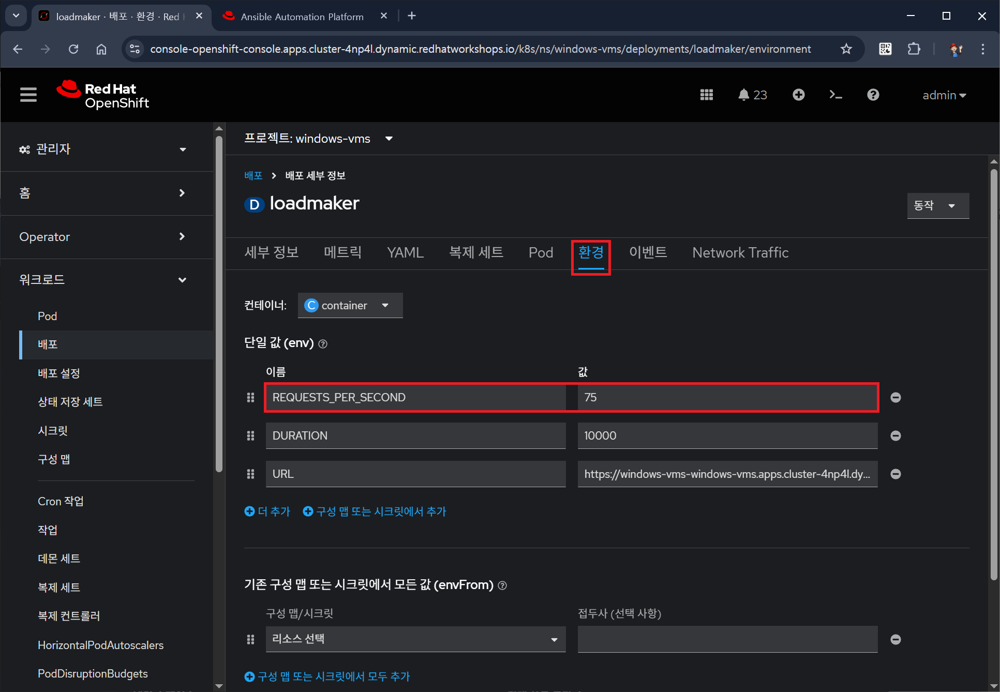
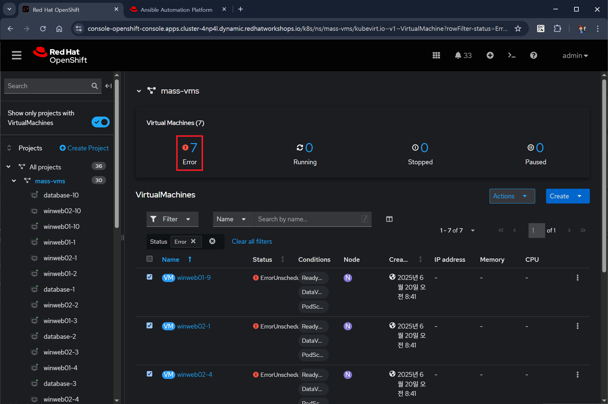

# 오프시프트 가상화 스케일링 시나리오

**목차**

1. [테스트 환경 설정](scaling_scenario.md#1-테스트-환경-설정)<br>
   1.1 [랩 테스트 환경](scaling_scenario.md#11-랩-테스트-환경)<br>
   1.1 [부하 생성 설정](scaling_scenario.md#12-부하-생성-설정)<br>

2. [가상머신 리소스 사용률 검사](scaling_scenario.md#2-가상머신-리소스-사용률-검사)<br>
   2.1 [프로젝트 windows-vms의 가사머신 리스트 확인](scaling_scenario.md#21-프로젝트-windows-vms의-가상머신-리스트-확인)<br>
   2.2 [가상머신 winweb01의 리소스 사용률 확인](scaling_scenario.md#22-가상머신-winweb01-리소스-사용률-확인)<br>

3. [가상머신 스케일링](scaling_scenario.md#3-가상머신-스케일링)<br>
   3.1 [가상머신 리소스 수평 확장](scaling_scenario.md#31-가상머신-리소스-수평-확장)<br>
   3.2 [가상머신 리소스 수직 확장](scaling_scenario.md#32-가상머신-리소스-수직-확장)<br>

4. [클러스터 확장](scaling_scenario.md#4-클러스터-확장)<br>
   4.1 [클러스터 리소스 부족과 해결 방안](scaling_scenario.md#41-클러스터-리소스-부족과-해결-방안)<br>
   4.2 [노드 추가하여 클러스터 확장](scaling_scenario.md#42-노드-추가하여-클러스터-확장)<br>
<br>
<br>

## 1. 테스트 환경 설정

### 1.1 랩 테스트 환경

* 가상머신 winweb01, winweb02 및 데이터베이스 서버는 함께 작동
* 두 웹 서버 간의 웹 요청 로드 밸런싱을 통해 부하를 줄이고 성능을 향상시키는 간단한 웹 기반 애플리케이션을 제공
* 현재 웹 서버는 하나만 작동 중이며, 현재 많은 수요를 보임
*  웹 서버를 수평 확장하여 가상머신의 부하를 줄이는 방법과 오픈시프트 가상화의 기본 메트릭 및 그래프를 사용하여 부하를 진단하는 방법 확인

### 1.2 부하 생성 설정

#### 1.2.1 오픈시프트 콘솔 *관리자* 모드에서 **워크로드** **배포** 클릭 후, 프로제트를 *windows-vms*로 변경


* 배포 *loadmaker*가 있음

#### 1.2.2 배포 *loadmaker*를 클릭하여 **세부 정보** 탭 확인


#### 1.2.3 **환경** 탭을 클릭하여 환경 변수 *REQUESTS_PER_SECOND*를 `75`로 변경하고 **저장** 클릭



<br>
<br>

## 2. 가상머신 리소스 사용률 검사

### 2.1 프로젝트 *windows-vms*의 가상머신 리스트 확인 

#### 2.1.1 오픈시프트 콘솔을 *Virtualization* 모드로 변경

#### 2.1.2 **VirtualMachines**의 프로젝트 트리에서 *windows-vms* 선택


* 가상머신 리스트
  + databse (실행 중)
  + winweb01 (실행 중)
  + winweb02
* 현재 2개의 가상머신만 실행 중인 것을 확인
<br>

### 2.2 가상머신 *winweb01* 리소스 사용률 확인

#### 2.2.1 가상머신 *winweb01* 클릭 후, **Overveiw** 탭 하단의 **Utilization** 패널을 통해 사용률 확인


#### 2.2.2 **Metrics** 탭을 클릭하여 CPU 사용률 그래프 확인


#### 2.2.3 CPU 그래프를 클릭하여 확인


* 값이 1.0보드 크면 CPU 100% 의미
<br>
<br>

## 3. 가상머신 스케일링

### 3.1 가상머신 리소스 수평 확장

#### 3.1.1 가상머신 *winweb02*를 선택 후, 상태가 *Stopped*인 것을 확인하고, **Start** 버튼을 클릭


#### 3.1.2 가상머신 *winweb01*의 CPU 메트릭을 다시 확인


* CPU 사용률이 줄어들고 있음

#### 3.1.3 **쿼리 추가**를 클릭하여 가상머신 *winweb02*에 대한 쿼리를 입력


* 추가할 쿼리
  ```sql
  sum(rate(kubevirt_vmi_cpu_usage_seconds_total{name='winweb02',namespace='windows-vms'}[5m])) BY (name, namespace)
  ```

#### 3.1.4 **쿼리 실행**을 클릭하여 메트리 확인


* 가상머신을 수평적으로 확장하였으나 여전히 CPU 사용률이 높음
* 수평적으로 더 확장하거나 그럴 수 없는 경우에는 수직적으로 확장 필요
<br>

### 3.2 가상머신 리소스 수직 확장

#### 3.2.1 가상머신 *winweb01*의 **Configuration** 탭을 선택 후, **CPU | Memeory**를 클릭


#### 3.2.2 vCPU를 `4`로 변경 후 **Save**를 클릭


#### 3.2.3 **Overview** 탭을 클릭하여 변경된 **CPU | Memory** 및 사용률 확인


#### 3.2.4 가상머신 *winweb02*도 vCPU를 4로 변경

#### 3.2.5 변경 후 가상머신의 CPU 사용률이 줄어든 것을 확인


#### 3.2.6 가상머신의 CPU 메트릭 확인


<br>
<br>

## 4. 클러스터 확장

### 4.1 클러스터 리소스 부족과 해결 방안

#### 4.1.1 클러스터 리소스 부족 시나리오

* 때로는 모든 물리적 리소스를 소진하여 특정 워크로드에 맞춰 CPU 또는 메모리 리소스를 늘릴 수 없는 경우가 있음
  + 오픈시프트는 기본적으로 CPU에 대해 10:1의 오버커밋 비율을 사용
  + 하지만, 쿠버네티스 환경에서 메모리는 종종 유한한 리소스

* 일반적인 쿠버네티스 클러스터는 높은 워크로드 리소스 사용률로 인해 메모리 부족 시나리오에 직면하면 무차별적으로 파드를 종료하기 시작
  + 컨테이너 기반 애플리케이션 환경에서는 일반적으로 로드 밸런서 서비스 뒤에 여러 개의 애플리케이션 복제본을 두어 이러한 문제를 완화
  + 애플리케이션은 다른 복제본에서 서비스를 제공하면서 계속 사용 가능하며, 종료된 파드는 사용 가능한 리소스가 있는 노드에 재할당

* 이 방법은 대부분의 경우 여러 복제본으로 구성되지 않고 지속적으로 사용 가능해야 하는 가상 머신 워크로드에는 적합하지 않음


#### 4.2.2 스왑 및 메모리 오버커밋

* 클러스터의 물리적 리소스가 고갈된 경우,
  + 기존에는 클러스터를 확장하는 것이 일반적
  + 하지만, 실제로는 쉽지 않음
  + 확장을 위해 대기 중인 예비 물리적 노드가 없어 새 하드웨어를 주문해야 하는 경우, 조달 절차나 공급망 중단으로 인해 지연되는 경우가 많음

* 이를 해결하는 한 가지 방법 - 노드에서 SWAP/메모리 오버커밋을 일시적으로 활성화
  + 새 하드웨어가 도착할 때까지 시간을 벌 수 있음
  + 이렇게 하면 작업자 노드가 SWAP을 수행하고 하드 디스크 공간을 사용하여 애플리케이션 메모리에 쓸 수 있음
  + 하드 디스크에 쓰는 것은 시스템 메모리에 쓰는 것보다 훨씬 느리지만, 추가 리소스가 도착할 때까지 워크로드를 보존 가능

#### 4.2.3 클러스터에 노드 추가

* 클러스터의 물리적 리소스가 부족할 때 가장 효과적인 방법은 작업자 노드를 추가하여 클러스터를 확장
  + 이렇게 하면 장애가 발생하거나 할당할 수 없는 워크로드를 성공적으로 할당 가능
  
* 실습에서는 바로 이러한 아이디어를 바탕으로 클러스터에 과부하를 발생시킨 후, 모든 VM이 성공적으로 실행될 수 있도록 새 노드를 추가
  + 실습 환경에서는 실제로 물리적 노드를 추가하는 것이 아니라, 가상머신 워크로드를 허용하지 않도록 오염된 노드를 대기 상태로 설정하여 동작을 시뮬레이션
  + 적절한 시점에 이 오염을 제거하여 클러스터에 새 노드를 추가하는 것을 시뮬레이션

<br>

### 4.2 노드 추가하여 클러스터 확장

#### 4.2.1 프로젝트 *vms-aap-day2* 및 *windows-vms*의 모든 가상머신을 실행 중인 지 확인


#### 4.2.2 프로젝트 트리에서 *mass-vms* 선택 후, 페이지 보기를 50으로 변경


#### 4.2.3 모든 가상머신을 선택 후 **Actions**를 클릭하여 **Start**를 선택


#### 4.2.4 상단의 **Error**에 표시된 가상머신 수 확인 후 클릭



* 장애난 가상머신의 상태가 `ErrorUnschedulable`임을 확인

#### 4.2.5 **컴퓨팅** **노드**를 클릭하여 워커 노드의 포드 수 확인


#### 4.2.6 워커노드-2를 클릭하여 **개요** 탭 확인


* 메모리가 부족하다는 경고를 확인

#### 4.2.7 하단에서 그래프를 통해 메모리 부족을 확인


#### 4.2.8 **Pod** 탭을 클릭 후 필터로 *virt-launcher* 입력


* *virt-launcher* 포드가 많은 메모리 사용 중인 것을 확인

#### 4.2.9 워커노드-1을 클릭하여 **개요** 탭 확인


* 메모리 부족 경고 없음
* 그래프를 보면 메모리 사용률이 낮음

#### 4.2.10 워커노드-1의 **Pod** 탭을 클릭 후 필터로 *virt-launcher* 입력


* 실행 중인 *virt-launcher* 포드가 없음을 확인

#### 4.2.11 워커노드-1의 **세부 정보** 탭을 클릭 후 하단의 **테인트** 확인


* 테인트가 `1 Taint_other`인 것을 확인

#### 4.2.12 **테이트**를 클릭하여, **-**를 클릭하여 설정된 테인트 제거 후 **저장**을 클릭


#### 4.2.13 워커노드-1의 **Pod** 탭을 클릭 후 필터로 *virt-launcher* 입력


* *virt-launcher* 포드가 새롭게 추가된 것을 확인

#### 4.2.14 **VirtaulMachines**를 클릭하여 **Error**가 `0`인 것을 확인


<br>
<br>

------
[차례](../README.md) &nbsp;&nbsp;&nbsp;&nbsp; [<< 기본적인 Day-2 운영 <<](./basic_day_2_day_ops.md) &nbsp;&nbsp;&nbsp;&nbsp; [>> 오픈시프트 가상화 기본 >>](./scale_to_moon.md)